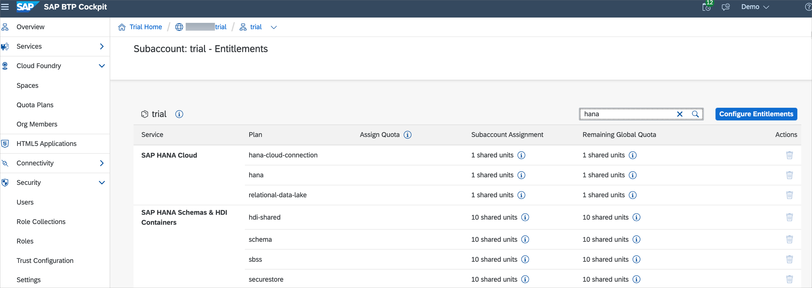

# Iniciando

**Antes de começar os exercícios da sessão, certifique-se de que você tem sua subconta BTP criada na região `US East (VA) - AWS [cf-us10]`. Você usará o serviço SAP HANA Cloud nesta sessão, que está disponível apenas na região mencionada.**

  

Assim que você tiver sua subconta BTP configurada na região exigida, comece a concluir os pré-requisitos abaixo.

- [Iniciando](#iniciando)
    - [Adicione o SAP HANA Cloud ao seu trial existente do BTP](#adicione-o-sap-hana-cloud-ao-seu-trial-existente-do-btp)
    - [Configurar o SAP Business Application Studio para desenvolvimento SAP CAP e MDK](#configurar-o-sap-business-application-studio-para-desenvolvimento-sap-cap-e-mdk)
    - [Clonar o repositório da sessão do TechEd](#clonar-o-repositório-da-sessão-do-teched)
    - [Configuração Inicial de um Aplicativo MDK](#configuração-inicial-de-um-aplicativo-mdk)
    - [Baixe o Cliente SAP Mobile Services no seu dispositivo](#baixe-o-cliente-sap-mobile-services-no-seu-dispositivo)
  - [Resumo](#resumo)

### Adicione o SAP HANA Cloud ao seu trial existente do BTP

1. No cockpit do trial do [SAP BTP](https://account.hanatrial.ondemand.com/trial), navegue até sua subconta.

2. Clique em **`Entitlements`** no menu à esquerda.

    

3. Certifique-se de ter direitos para os serviços (e planos de serviços) listados aqui:

    - SAP HANA Cloud: `hana-cloud-connection`, `hana` e `relational-data-lake`

    - Esquemas e contêineres HDI do SAP HANA: `hdi-shared`, `schema`, `sbss` e `securestore`

    

    Se você já adicionou os direitos necessários em sua conta trial, continue com a etapa 8 para criar sua instância de trial do SAP HANA Cloud, SAP HANA Database.
    Se você não tiver os direitos necessários em sua conta trial, continue com a próxima etapa.

4. Se você não tiver nenhum dos direitos acima, precisará adicioná-los à sua conta. Para fazer isso, clique em **Configurar Direitos** no canto superior direito da tela.

    

5. Clique em **Adicionar planos de serviços** na mesma área da tela.

    

6. Na janela que abrir, digite `HANA` na caixa de pesquisa para ver todas as concessões relevantes. Selecione todos os planos disponíveis para as concessões destacadas (**SAP HANA Cloud** e **SAP HANA Schemas e HDI Containers**) e clique em **Adicionar X planos de serviço**.

    

    >A razão para não selecionar a concessão SAP HANA Schemas e HDI Containers (trial) é que ela é feita para um trial do Serviço SAP HANA, não para o SAP HANA Cloud.

7. No canto superior direito da tela, certifique-se de clicar em **Salvar**.

    

    Você agora adicionou a concessão SAP HANA Cloud à sua conta trial existente no SAP BTP! Agora você criará sua instância de trial do SAP HANA Cloud, SAP HANA Database.

8. Navegue até a Home do SAP BTP Cockpit e clique no seu espaço em `Spaces`.

    

9. No menu à esquerda da tela, clique em **SAP HANA Cloud** > **Criar** > **SAP HANA Database**.

    

10. Uma nova guia será aberta no **SAP HANA Cloud Central**, escolha a instância **SAP HANA Cloud, SAP HANA Database** e clique em **Próxima etapa** para continuar.

    

11. Forneça um nome de instância, senha do administrador e confirme a senha do administrador. Clique em **Próxima etapa**.

  

11. Na etapa **SAP HANA Database**, mantenha a memória padrão e clique em **Próxima etapa**.

  

12. **Zona de disponibilidade e réplicas do SAP HANA Database** não é aplicável no BTP trial, clique em **Próxima etapa**.

  
    
1.  Na etapa **Configurações avançadas do SAP HANA Database**, certifique-se de selecionar **`Allow all IP address`** e clique em **Próxima etapa**.

  

14. Na etapa **Data Lake**, mantenha a configuração padrão como está e clique em **Review and Create**.

  

15. Reveja as informações da instância e clique em **Create Instance**.

  

  Sua instância do SAP HANA Cloud começará a ser criada. Por favor, tenha paciência, ela estará em status de execução em breve. 
  

Por favor, lembre-se:

* Se você estiver usando um modelo de camada gratuita ou uma conta de teste, você só poderá criar uma instância com tamanho pré-definido (30GB de memória, 2vCPUs e 120GB de armazenamento). No entanto, o processo para criar a      instância é muito semelhante ao que você fará em um ambiente de produção.
* As instâncias de modelo de camada gratuita e teste serão interrompidas todos os dias por volta da meia-noite no fuso horário da localização do servidor que você selecionou. Cada vez que você começar a trabalhar com sua instância de modelo de camada gratuita ou de teste, você precisará reiniciá-la.
* Se você não reiniciar suas instâncias dentro de 60 dias, elas serão excluídas. Sua conta BTP, no entanto, continuará existindo e você poderá facilmente provisionar uma instância novamente, se desejar.

### Configurar o SAP Business Application Studio para desenvolvimento SAP CAP e MDK

1. Abra o SAP Business Application Studio em qualquer um dos [navegadores suportados](https://help.sap.com/docs/SAP%20Business%20Application%20Studio/9d1db9835307451daa8c930fbd9ab264/8f46c6e6f86641cc900871c903761fd4.html#availability). Você pode acessá-lo em https://account.hanatrial.ondemand.com 

  

  >Você também pode acessá-lo através do cockpit do SAP BTP > Service Marketplace. 
  

  Uma nova aba é aberta. Se você ainda não criou um espaço de desenvolvimento, a página de boas-vindas do SAP Business Application Studio é carregada. 

  

  >Se este não for o primeiro espaço de desenvolvimento, o gerenciador de espaços de desenvolvimento para SAP Business Application Studio é carregado. 

  

2. Clique em **Criar espaço de desenvolvimento**. 

   Forneça um nome para o seu espaço de desenvolvimento, selecione **Aplicativo móvel SAP** como tipo de aplicativo. Selecione **Modelador gráfico CDS** e **Ferramentas CAP** como extensões SAP adicionais. Continue com **Criar espaço de desenvolvimento**.

  

3. Quando estiver pronto, abra seu espaço de desenvolvimento clicando no nome.  

  

>Salve o URL do **SAP Business Application studio** para acesso rápido, pois você visitará esta página novamente nos exercícios seguintes.
 

### Clonar o repositório da sessão do TechEd

Antes de começar os exercícios da sessão, vamos clonar o repositório git da sessão para o espaço de trabalho do SAP Business Application Studio.

1. Na página de Início, selecione `Clonar do Git`.

  

  >Se você não vir a página `Início`, você pode acessá-la digitando `>get started` na barra de pesquisa central.

  

2. No campo `Fornecer URL do repositório`, copie e cole a URL https://github.com/SAP-samples/teched2022-AD181 para o repositório da sessão e pressione **Enter**.

  

3. Quando o clone estiver concluído, clique no X para fechar a notificação popup.

  

### Configuração Inicial de um Aplicativo MDK

Você criará a configuração inicial do aplicativo no cockpit do SAP Mobile Services.

1. No [cockpit de avaliação do SAP BTP](https://account.hanatrial.ondemand.com/trial), navegue até a sua subconta e clique nela.

   

2. No painel esquerdo, escolha **Serviços → Service Marketplace**.

   

3. Procure por **Mobile** e clique no tile **Mobile Services**.

   

4. Escolha **Suporte** para abrir o **Cockpit do SAP Mobile Services**.
   
    

    >Se você não vê o link `Suporte`, certifique-se de que está no nível da subconta, não no nível do espaço. Por favor, olhe novamente para o passo 2.

     
5. Se for solicitado que você faça login, insira seu email ou nome de usuário para continuar e clique em **Avançar**.

6. Escolha a **Organização** e **Espaço** relevantes na lista suspensa e, em seguida, selecione **Abrir**.

    

    >- Se você não ver nenhuma opção na lista suspensa, verifique se seu ambiente do Cloud Foundry é uma paisagem estendida. Para fazer isso, verifique o valor `API Endpoint` para a organização Cloud Foundry na página de visão geral do cockpit SAP BTP.
    >    
    >- Se o `API Endpoint` incluir "-00X" (onde 'X' é um número, por exemplo, https://api.cf.us10-001.hana.ondemand.com), a organização Cloud Foundry está sendo executada em uma paisagem estendida do Cloud Foundry. 
    >- Em seu cockpit SAP BTP, navegue até `Serviços` |  `Instâncias e assinaturas` e crie uma instância de **Mobile Services**.
      >      
      >      
    >- Depois de criar uma nova instância de Mobile Services, clique no ícone de 3 pontos e selecione o link **View Dashboard** para abrir o cockpit do SAP Mobile Services. 
      >      
    >- Escolha seu provedor de identidade, se solicitado. A página do cockpit de SAP Mobile Services é aberta. Restaure o aplicativo para repará-lo, se necessário. 
      >    
    >- Se você vir o erro `Nenhuma organização existe`, limpe o cache do seu navegador e tente novamente, iniciando o cockpit de SAP Mobile Services via a opção `Abrir painel`.  

7. Depois de fazer login no cockpit de SAP Mobile Services, clique em **Criar novo aplicativo** na página `Home` ou navegue até **Aplicativos móveis | Nativo/MDK | Novo**.

    

8. Na etapa **Informações básicas**, forneça as informações necessárias e clique em **Avançar**.

    | Campo  | Valor                           |
    | ------ | ------------------------------- |
    | `ID`   | com.sap.teched.ad181            |
    | `Nome` | SAP MDK App - TechEd 2022 AD181 |

     
    

9. Na etapa **Configurações do XSUAA**, continue com as configurações padrão e clique em **Avançar** para navegar para outras etapas.

     

10. Na etapa **Atribuir recursos**, escolha **Aplicativo Mobile Development Kit** no menu suspenso e clique em **Finish**.

     

    >Se você vir uma janela _Confirmar Conclusão_, clique em **OK**.

     Depois de criar seu aplicativo, você verá uma lista de recursos padrão atribuídos automaticamente ao aplicativo.

     

11. Clique em **Mobile Settings Exchange**, defina o **Lock Timeout** para 120 segundos. Esse valor define por quanto tempo o aplicativo pode ficar inativo antes que o usuário precise inserir o código de acesso do aplicativo novamente para continuar a usá-lo. 

    

Salve o URL do **Cockpit de Serviços Mobile** nos seus favoritos para acessá-lo rapidamente, pois você visitará esta página novamente para adicionar uma destination.

### Baixe o Cliente SAP Mobile Services no seu dispositivo

Baixe e instale o *SAP Mobile Services Client* no seu dispositivo Android ou iOS. 

  |                                                    Android                                                     |                                                     iOS                                                      |
  | :------------------------------------------------------------------------------------------------------------: | :----------------------------------------------------------------------------------------------------------: |
  | Escaneie o código QR abaixo no seu dispositivo para baixar o cliente no Google Play  | Escaneie o código QR abaixo no seu dispositivo para baixar o cliente na App Store  |

## Resumo

Você concluiu agora o pré-requisito para começar com os exercícios da sessão.

Continue para - [Exercício 1 - Implante um Serviço de Negócios CAP na Plataforma de Tecnologia Empresarial SAP](../ex1/README.md)

