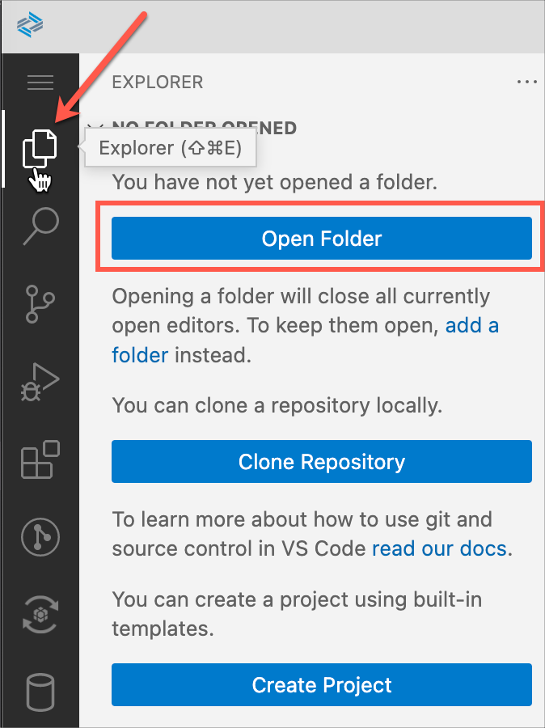
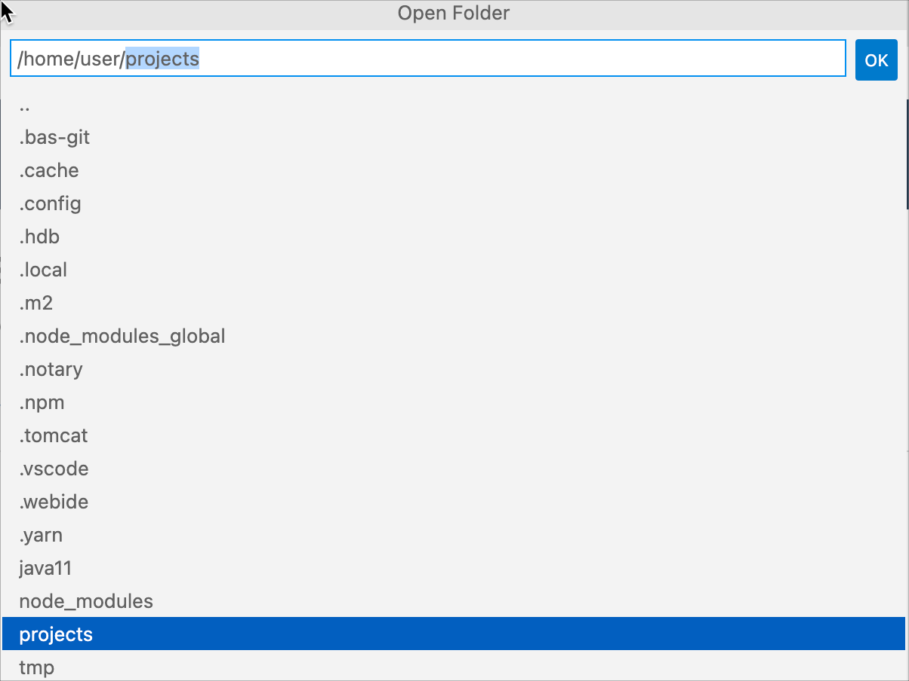
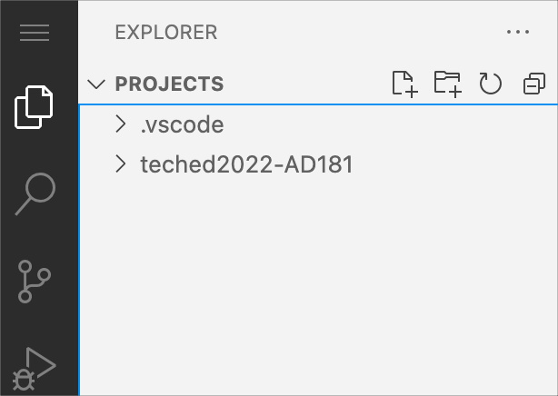
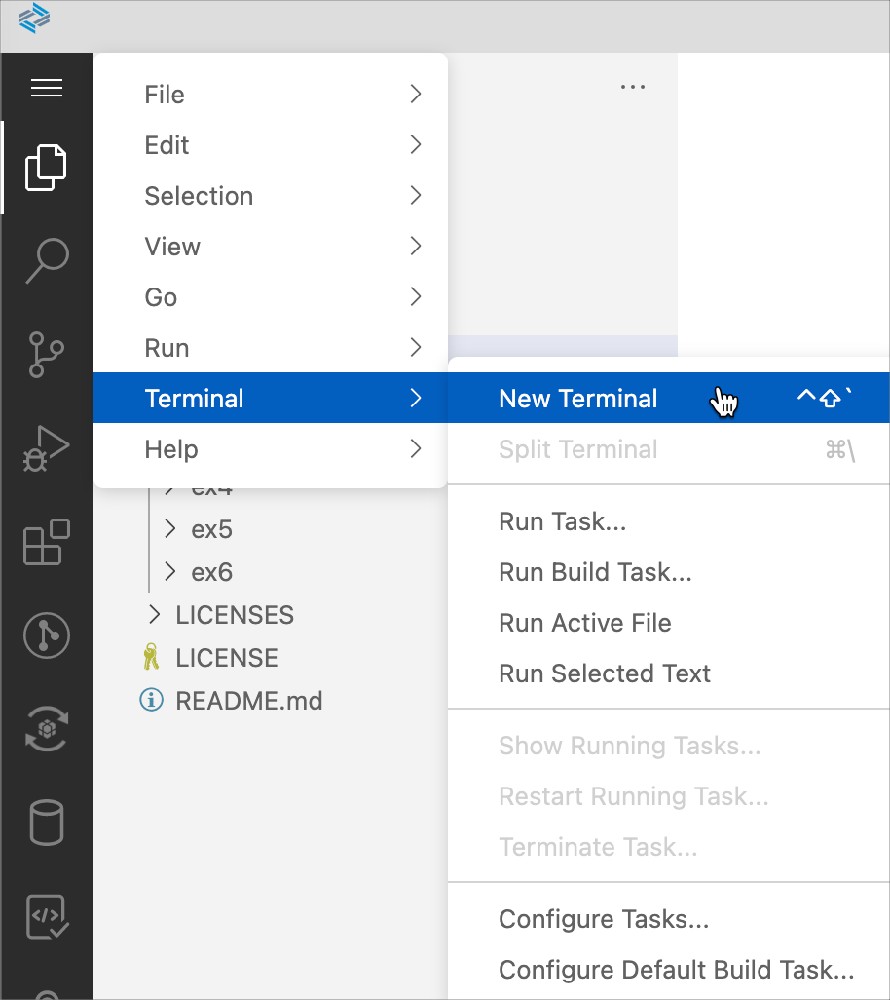
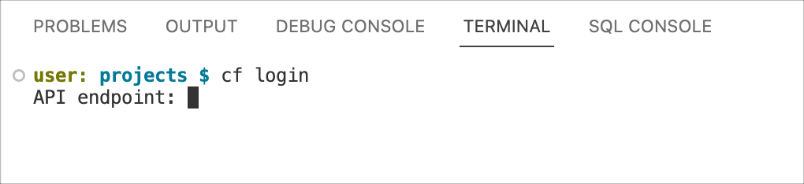
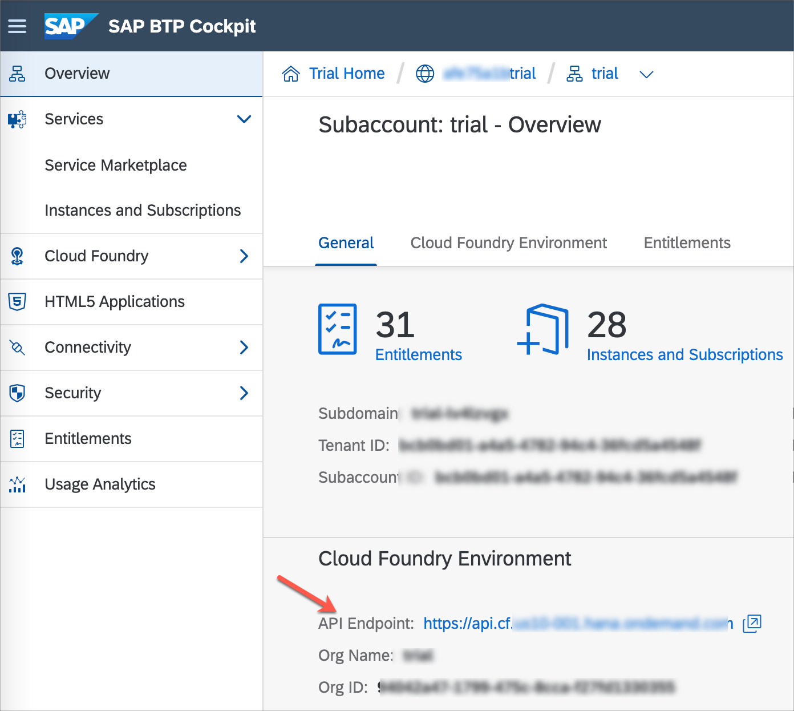
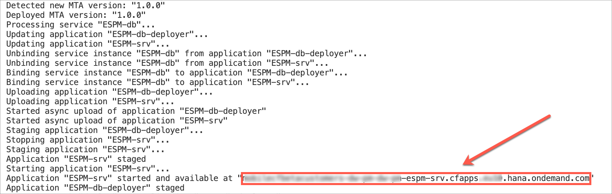
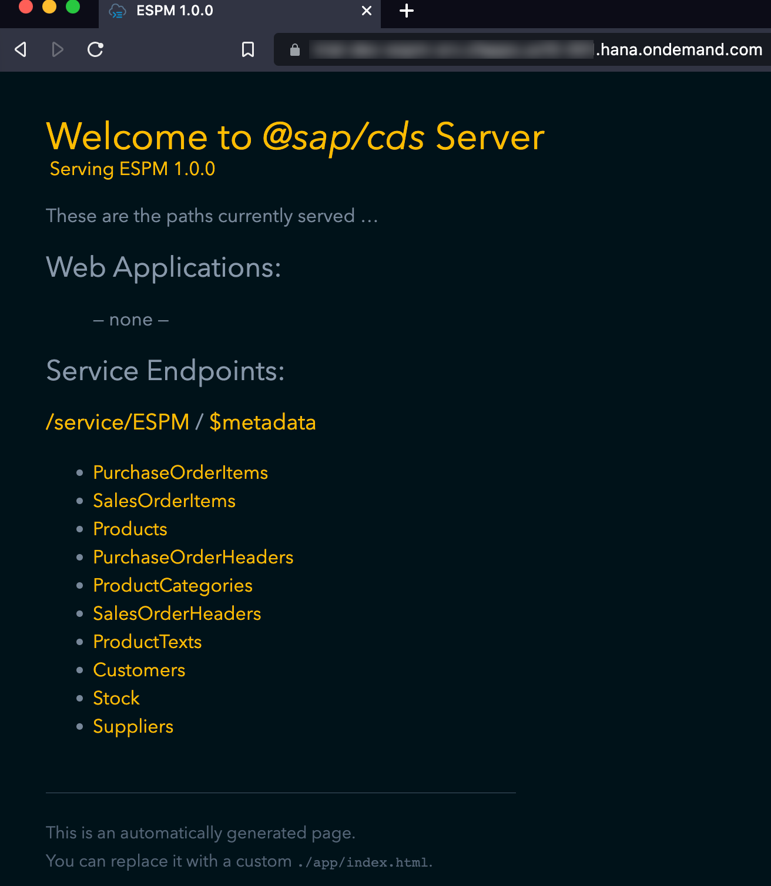
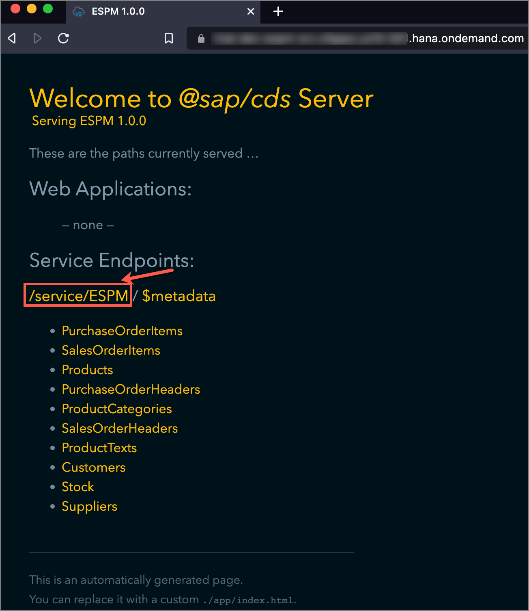
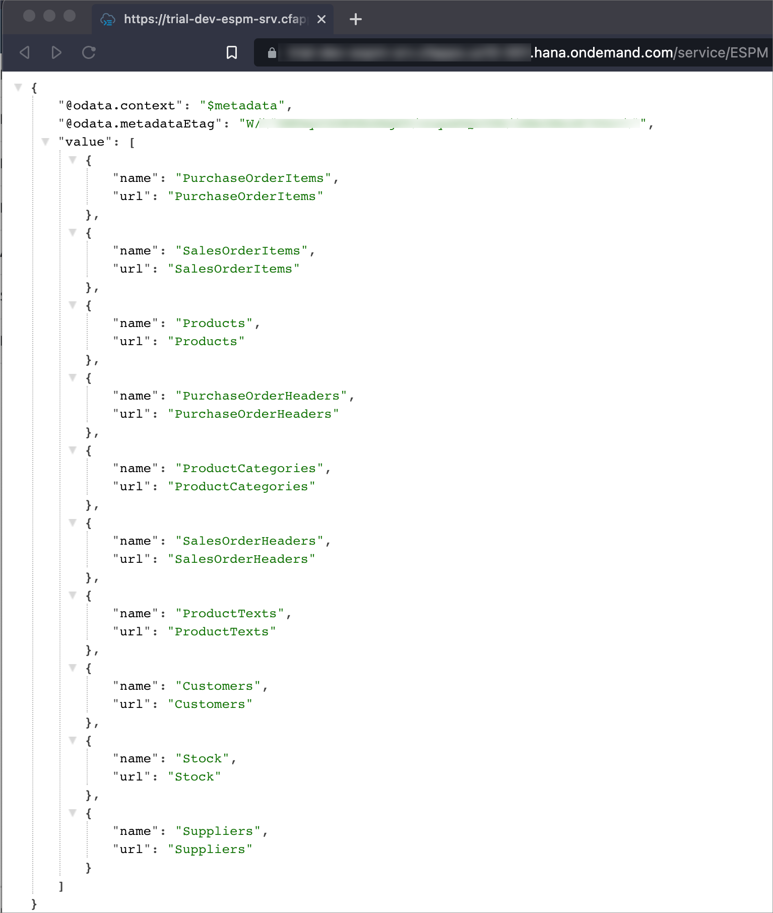

# Exercício 1 - Implantar um Serviço de Negócios CAP na SAP Business Technology Platform

Neste exercício, você implantará seu projeto SAP Cloud Application Programming Model (CAP) na plataforma SAP Business Technology Platform (BTP), ambiente Cloud Foundry usando o serviço SAP HANA Cloud.

- [Exercício 1 - Implantar um Serviço de Negócios CAP na SAP Business Technology Platform](#exercício-1---implantar-um-serviço-de-negócios-cap-na-sap-business-technology-platform)
- [Exercício 1.1 - Alterar o espaço de trabalho para a pasta de projetos](#exercício-11---alterar-o-espaço-de-trabalho-para-a-pasta-de-projetos)
- [Exercício 1.2 - Implantar um projeto CAP na SAP Business Technology Platform](#exercício-12---implantar-um-projeto-cap-na-sap-business-technology-platform)
- [Resumo](#resumo)

### Exercício 1.1 - Alterar o espaço de trabalho para a pasta de projetos

1. Inicie o SAP Business Application Studio ou acesse-o em https://account.hanatrial.ondemand.com.

2. Altere seu espaço de trabalho para a pasta `projects`. Clique no ícone Explorer e clique em **Open Folder**.

    

3. Selecione a pasta `projects` se ainda não estiver selecionada e clique em **OK**.

    

    A página BAS recarregará no navegador e você agora verá a pasta PROJECTS aberta como espaço de trabalho.

    

## Exercício 1.2 - Implantar um projeto CAP na SAP Business Technology Platform

> Antes de implantar o projeto CAP, certifique-se de que sua instância da nuvem do HANA está em execução.
>  

1. Navegue até o menu `Terminal` | `New Terminal`. 

    

2. Execute o comando abaixo para criar uma sessão Cloud Foundry. Depois de fazer login com sucesso, selecione sua organização e espaço.

    ```shell
    cf login
    ```

    OU execute o comando abaixo se o seu usuário estiver configurado com autenticação multifatorial. Insira o código de autenticação temporário do link de senha.

    ```shell
    cf login --sso
    ```

      

    > Você pode obter o endpoint da API na sua conta do Cloud Foundry.
     
   

3. Execute o comando abaixo definindo o caminho atual para o seu projeto CAP.

    ```shell
    cd teched2022-AD181/exercises/ex1/ESPM-main
    ```

4. Execute o script abaixo para implantar o projeto CAP na SAP BTP.

    ```shell
    sh deployCFMTA.sh
    ```

     

    Quando o processo de implantação terminar, você verá uma mensagem sobre a disponibilidade do aplicativo `ESPM-srv`. 

     

    > Se você vir `Error retrieving MTA: Could not find MTA ESPM_1.0.0.mtar` na janela do terminal, certifique-se de que adicionou o Modelador Gráfico CDS e as Ferramentas CAP necessárias como extensões SAP adicionais em seu espaço de desenvolvimento. Verifique este [pré-requisito](../ex0/README.md#set-up-sap-business-application-studio-for-sap-cap-and-mdk-development).

    O URL destacado na captura de tela acima é o endpoint do serviço. Copie-o e cole em uma nova guia no seu navegador. 

     

    A lista de endpoints de serviço exibe vários caminhos para acessar informações, como documentos de serviço, documentos de metadados de serviço e entidades disponíveis.

    Para encontrar o destino necessário para o desenvolvimento móvel, clique no caminho `/service/ESPM`. 

     

    A página resultante exibe a lista de conjuntos de entidades do seu serviço OData. 

     

    **Faça uma nota deste URL, pois você configurará este endpoint como uma destination nos Serviços Móveis.**

    > Se você ver a saída em formato Raw, pode instalar qualquer extensão `JSON formatter` no seu navegador para obter uma saída analisada de maneira mais estruturada.

## Resumo

Agora você gerou um serviço OData com base no Modelo de Programação de Nuvem SAP (CAP).

Continue para - [Exercício 2 - Criar um aplicativo a partir do modelo MDK](../ex2/README.md)

