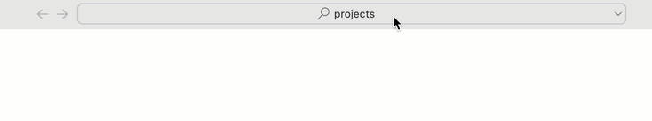
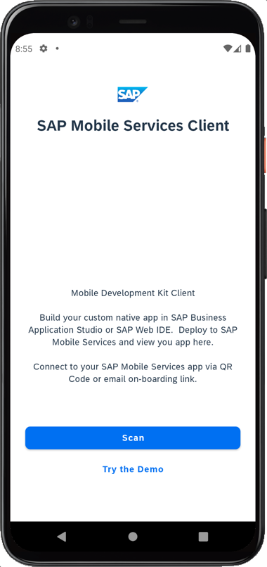
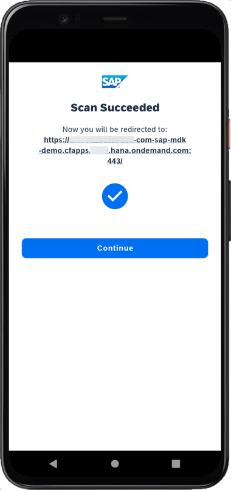
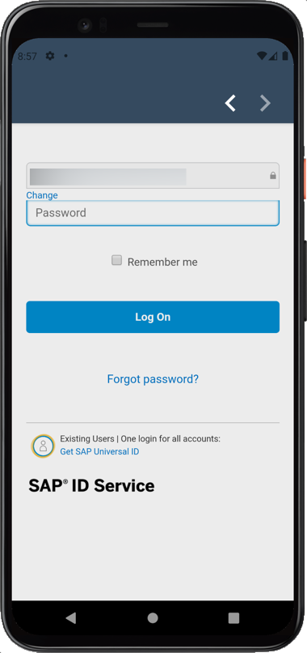
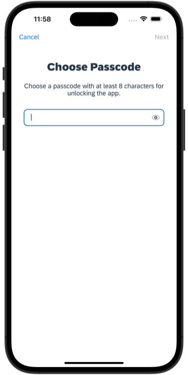
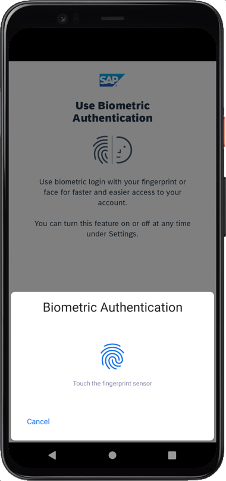
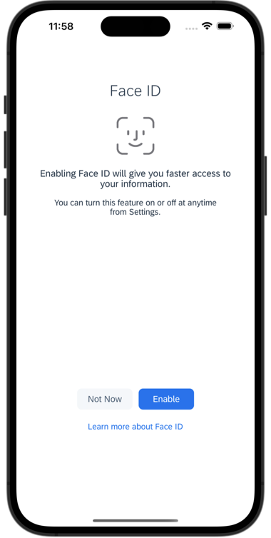
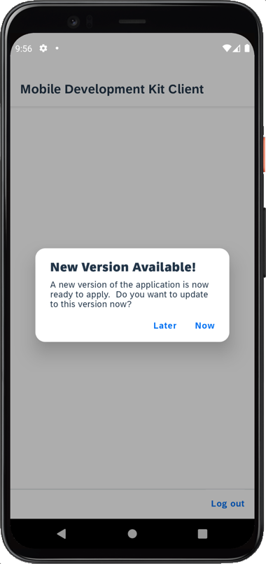

# Exercício 2 - Criar uma aplicação a partir do modelo MDK

Neste exercício, você irá criar uma aplicação MDK a partir de um modelo.
- [Exercício 2 - Criar uma aplicação a partir do modelo MDK](#exercício-2---criar-uma-aplicação-a-partir-do-modelo-mdk)
    - [Exercício 2.1 - Configurar seu Serviço OData como Destino em Serviços Móveis](#exercício-21---configurar-seu-serviço-odata-como-destino-em-serviços-móveis)
    - [Exercício 2.2 - Criar o projeto MDKApp a partir de um modelo](#exercício-22---criar-o-projeto-mdkapp-a-partir-de-um-modelo)
    - [Exercício 2.3 - Mudando o workspace para a pasta de projetos](#exercício-23---mudando-o-workspace-para-a-pasta-de-projetos)
    - [Exercício 2.4 - Implantar a aplicação](#exercício-24---implantar-a-aplicação)
    - [Exercício 2.5 - Exibir o código QR para embarcar o aplicativo móvel](#exercício-25---exibir-o-código-qr-para-embarcar-o-aplicativo-móvel)
    - [Exercício 2.6 - Executando o aplicativo](#exercício-26---executando-o-aplicativo)
  - [Resumo](#resumo)

### Exercício 2.1 - Configurar seu Serviço OData como Destino em Serviços Móveis

1. Acesse o Cockpit de Serviços Móveis. Se a sessão dos Serviços Móveis tiver expirado, faça login novamente.
2. Navegue até *SAP MDK App - TechEd 2022 AD181* (`com.sap.teched.ad181`) e selecione **Conectividade Móvel** em Recursos atribuídos.

    

3. Clique no ícone **Criar** para adicionar um novo destino.
   
    

4. Na etapa **Informações Básicas**, forneça as informações necessárias e clique em **Avançar**.

    | Campo             | Valor                                                            |
    | ----------------- | ---------------------------------------------------------------- |
    | `Nome do Destino` | ESPM                                                             |
    | `URL`             | Insira a URL do documento de serviço do seu serviço OData do CAP |

    

5. Para este exercício, não são necessárias configurações de Cabeçalhos Personalizados, Anotações, Configuração de Destino ou Mecanismo de SSO. Clique em **Avançar** para navegar pelas etapas e clique em **Concluir**.

6. Agora você testará essa URL via Mobile Services para garantir que ela possa ser acessada e recuperar os dados via Mobile Services. Clique na navegação destacada "Mobile Connectivity" para voltar à página anterior.

    

7. Clique no ícone "Launch in Browser" (Abrir no navegador).

    

    Uma nova guia será aberta em seu navegador e a saída resultante é o documento de serviço do seu serviço OData (acessado via Mobile Services).

    

    > Se você vir a saída em formato bruto, pode instalar qualquer extensão de "formatador de JSON" em seu navegador para obter uma saída formatada de forma mais estruturada.

8. Remova `?auth=uaa` na URL e acrescente um EntitySet, por exemplo, `Products` para verificar os dados relacionados.

    

    Da mesma forma, você pode recuperar os dados para outras entidades e executar outras consultas OData.

### Exercício 2.2 - Criar o projeto MDKApp a partir de um modelo

1. Acesse sua página do SAP Business Application Studio. No seu espaço Dev, clique em **Começar a partir de modelo** na página Get Started.

    

    > Se você não ver a página `Get Started`, você pode acessá-la digitando `> get started` na barra de pesquisa central.

    

2. Selecione **Projeto MDK** e clique em **Iniciar**.

    

    > Se você não ver a opção **Projeto MDK**, verifique se o seu espaço Dev terminou de carregar ou atualize a página no seu navegador e tente novamente.

    > Esta tela só aparecerá quando a sua sessão de login no CF tiver expirado. Insira suas credenciais de login, clique em Sign in. Depois de ter efetuado login com sucesso no Cloud Foundry, selecione a sua organização e espaço do Cloud Foundry onde você configurou a configuração inicial para o seu aplicativo MDK e clique em Apply.
    >

    >- Se você não ver nenhuma opção na lista suspensa, por favor, verifique se o seu ambiente do Cloud Foundry é uma paisagem estendida. Para isso, verifique o valor do `Endpoint API` para a organização do Cloud Foundry na página de visão geral do cockpit do SAP BTP.
    >    

3. No passo *Informações básicas*, forneça as seguintes informações e clique em **Avançar**:

    | Campo                              | Valor                                                                                                                      |
    | ---------------------------------- | -------------------------------------------------------------------------------------------------------------------------- |
    | `Tipo de modelo MDK`               | Selecione `CRUD` na lista suspensa                                                                                         |
    | `Nome do seu projeto`              | Forneça um nome de sua escolha. `MDKApp` é usado para este tutorial                                                        |
    | `Nome da sua aplicação`            | <nome padrão é o mesmo que o nome do projeto, você pode fornecer qualquer nome de sua escolha>                             |
    | `Versão de cliente MDK de destino` | Deixe a seleção padrão como `MDK 6.0+ (Para uso com clientes MDK 6.0 ou posteriores)`                                      |
    | `Escolha uma pasta de destino`     | Por padrão, a pasta de destino usa o caminho raiz do projeto. No entanto, você pode escolher um caminho de pasta diferente |

     

4. Na etapa *Configuração de Serviço*, forneça as informações abaixo e clique em **Avançar**:

    | Campo                              | Valor                                                                                                                                                                               |
    | ---------------------------------- | ----------------------------------------------------------------------------------------------------------------------------------------------------------------------------------- |
    | `Fonte de Dados`                   | Selecione `Mobile Services` na lista suspensa                                                                                                                                       |
    | `Landscape do Mobile Services`     | Selecione `standard` na lista suspensa                                                                                                                                              |
    | `Id do Aplicativo`                 | Selecione `com.sap.teched.ad181` na lista suspensa (este app foi configurado conforme [exercício de pré-requisito](./../ex0/README.md#set-up-initial-configuration-for-an-mdk-app)) |
    | `Destino`                          | Selecione `ESPM` na lista suspensa                                                                                                                                                  |
    | `Insira um caminho para o serviço` | Deixe como está                                                                                                                                                                     |
    | `Habilitar Offline`                | Está habilitado por padrão                                                                                                                                                          |

    

    Independentemente de estar criando um aplicativo online ou offline, essa etapa é necessária para que o aplicativo se conecte a um serviço OData. Ao construir um aplicativo móvel MDK, ele assume que o serviço OData foi criado e que o destino que aponta para esse serviço foi configurado no Mobile Services.

    Como temos Habilitar Offline definido como Sim, o aplicativo gerado será habilitado para offline no cliente móvel MDK.

5. Na etapa *Coleções de Dados*, escolha **Sim** para selecionar todas as coleções de dados e clique em **Concluir** para concluir a criação do projeto.
   
    

    Ao final do processo de criação, o `MDKApp` será aberto como um espaço de trabalho no Business Application Studio.

    

### Exercício 2.3 - Mudando o workspace para a pasta de projetos

Mude o seu workspace para a pasta `projects`.

1. Clique no ícone de hambúrguer, selecione **File** | **Open Folder**.

    

2. Defina o caminho para a pasta `projects`, se ainda não estiver definido, e clique em **OK**.

    

    A pasta de projetos agora está aberta como workspace.

        

### Exercício 2.4 - Implantar a aplicação

Até agora, você aprendeu como construir um aplicativo MDK no editor SAP Business Application Studio. Agora, você implantará as definições do aplicativo no Mobile Services para usá-lo no cliente móvel.

1. Clique em `MDKApp` para expandir o projeto. Clique com o botão direito do mouse em `Application.app` e selecione **MDK: Deploy**.

    

2. Selecione o alvo de implantação como **Mobile Services**. O editor MDK implantará os metadados no Mobile Services.

    

    Se desejar habilitar a origem para depurar o pacote implantado, escolha Sim.

    

    Você deverá ver uma mensagem de implantação bem-sucedida.

    

### Exercício 2.5 - Exibir o código QR para embarcar o aplicativo móvel

O SAP Business Application Studio tem um recurso para exibir o código QR para embarcar no cliente móvel.

Clique em `Application.app` para abri-lo no Editor de Aplicativos MDK e, em seguida, clique no ícone **Application QR Code**.

O código QR de embarque é exibido.

>Deixe a caixa de diálogo de embarque aberta para a próxima etapa.

### Exercício 2.6 - Executando o aplicativo

| Etapas                                                                                                                                                                                                                         |                      Android                      |                                                iOS |
| :----------------------------------------------------------------------------------------------------------------------------------------------------------------------------------------------------------------------------- | :-----------------------------------------------: | -------------------------------------------------: |
| 1. Abra o aplicativo **`Mobile Svcs`** em seu dispositivo móvel. Toque em **Aceitar** no `Contrato de Licença do Usuário Final`                                                                                                |                           |                            |
| 2. Toque em **Escanear** para iniciar a câmera do dispositivo para escanear o código QR de integração. Observe que, se você já tiver o cliente MDK integrado, toque em *Começar* e *Escanear novo código QR* para continuar.   |                           |                            |
| 3. Quando a leitura for bem-sucedida, toque em **Continuar**.                                                                                                                                                                  |                           |                            |
| 4. Insira suas credenciais para fazer login na Plataforma de Tecnologia Empresarial (BTP) da SAP.                                                                                                                              |   |   |
| 5. Escolha um código de acesso com pelo menos 8 caracteres para desbloquear o aplicativo e toque em **Avançar**.                                                                                                               |                          |                           |
| 6. Confirme o código de acesso e toque em **Concluído**.                                                                                                                                                                       |                          |                           |
| 7. Opcionalmente, você pode ativar a autenticação biométrica para acessar mais rapidamente os dados do aplicativo, toque em **Ativar**.                                                                                        |                          |                           |
| 8. Toque em **Agora** para aceitar as definições de metadados implantadas.                                                                                                                                                     |                          |                           |
| Após aceitar a atualização do aplicativo, você verá a lista de entidades na página **Principal**, as opções **Sair**, **Sincronizar** e **Atualizar** na parte inferior da página e o armazenamento offline será inicializado. |                          |                           |

Toque em qualquer entidade e você será levado para uma página de lista onde pode criar um novo registro. Se selecionar um dos itens, a página de detalhes será exibida, onde poderá atualizar e excluir o registro. Este registro é salvo no banco de dados da fila de solicitações offline. Você pode voltar para a página principal e pressionar **Sincronizar** para enviar quaisquer alterações locais para o backend. Uma vez que o envio for bem-sucedido, os dados também serão baixados do backend para o armazenamento offline para ter o mesmo conjunto de dados em ambos os lados.

> Uma vez que você tenha escaneado e realizado o onboard usando a URL de onboard, ela será lembrada. Quando você fizer logout e onboard novamente, será perguntado se deseja continuar usando o aplicativo atual ou escanear um novo código QR.

## Resumo

Agora você criou e implantou sua aplicação MDK inicial.

Continue para - [Exercício 3 - Melhore a lista de produtos gerada e adicione uma barra de filtro na página](../ex3/README.md)
