# Exercício 3 - Melhore a lista de produtos gerada e adicione uma barra de filtro na página

Neste exercício, você irá melhorar a lista de produtos gerada e também adicionar uma barra de feedback de filtro que permite aplicar rapidamente filtros frequentemente utilizados. Esta barra de feedback de filtro aparecerá acima da lista de produtos.

- [Exercício 3 - Melhore a lista de produtos gerada e adicione uma barra de filtro na página](#exercício-3---melhore-a-lista-de-produtos-gerada-e-adicione-uma-barra-de-filtro-na-página)
    - [Exercício 3.1 - Aprimorando a página de lista de produtos](#exercício-31---aprimorando-a-página-de-lista-de-produtos)
    - [Exercício 3.2 - Adicione uma barra de feedback de filtro na página](#exercício-32---adicione-uma-barra-de-feedback-de-filtro-na-página)
    - [Exercício 3.3 - Redeploy da aplicação](#exercício-33---redeploy-da-aplicação)
    - [Exercício 3.4 - Atualize o aplicativo MDK com novos metadados](#exercício-34---atualize-o-aplicativo-mdk-com-novos-metadados)
  - [Resumo](#resumo)


### Exercício 3.1 - Aprimorando a página de lista de produtos

Na página de Lista de Produtos, você percebe que:

- Na coluna da esquerda, há informações duplicadas (por exemplo, Servidores) para um determinado produto. Esses valores pertencem às propriedades `Category` e `CategoryName` da entidade Produto. Os dados de teste para a entidade Produto têm os mesmos valores para essas propriedades.
- Na coluna da direita, há valores como o código da moeda e a dimensão de profundidade do Produto.

    |         Android          |           iOS            |
    | :----------------------: | :----------------------: |
    | 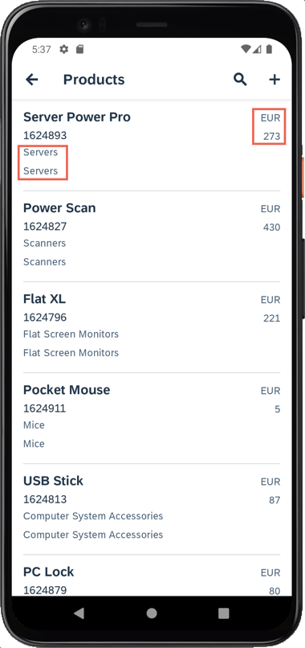 | 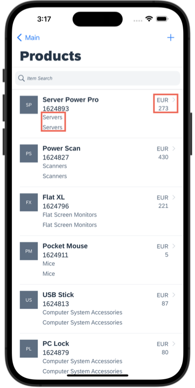 |

    > Observe que as capturas de tela deste exercício foram feitas em um dispositivo móvel. Se você estiver usando o cliente MDK em um tablet, a propriedade Description aparecerá na segunda coluna.

Seria mais significativo se exibíssemos:
- dimensões adicionais do produto, como Largura e Altura, juntamente com sua unidade, em vez de mostrar apenas a Profundidade.
- o preço do Produto com o código da moeda (formatador), em vez de apenas o código da moeda.

1. Navegue até `Páginas` | `Produtos` | `Products_List.page` e selecione o controle Object Table.
2. A propriedade Description do controle está atualmente vinculada à propriedade OData *{Category}*. Você substituirá esse vínculo pela dimensão do Produto.
    * Clique no ícone de link para a propriedade **Description**. Isso abrirá o Navegador de objetos.
    * Corte ou remova a expressão padrão no navegador de objetos.
    * Dê um duplo clique em `DimensionWidth`. Você verá a vinculação `{DimensionWidth}` gerada na caixa de expressão. **Não feche a janela do Navegador de objetos**.
    * Insira um espaço após o valor gerado, digite *x*.
    * Insira um espaço após o novo valor, selecione `DimensionDepth` e clique em `Inserir`. Você verá a vinculação `{DimensionWidth} x {DimensionDepth}` gerada na caixa de expressão.
    * Insira um espaço após o novo valor, digite *x*.
    * Insira um espaço após o novo valor, selecione `DimensionHeight` e clique em `Inserir`. Você verá a vinculação `{DimensionWidth} x {DimensionDepth} x {DimensionHeight}` gerada na caixa de expressão.
    * Insira um espaço após o novo valor, selecione `DimensionUnit` e clique em `Inserir`. A nova expressão deve ser semelhante a `{DimensionWidth} x {DimensionDepth} x {DimensionHeight} {DimensionUnit}`.
    * Clique em **OK** para definir o valor no campo de controle.

        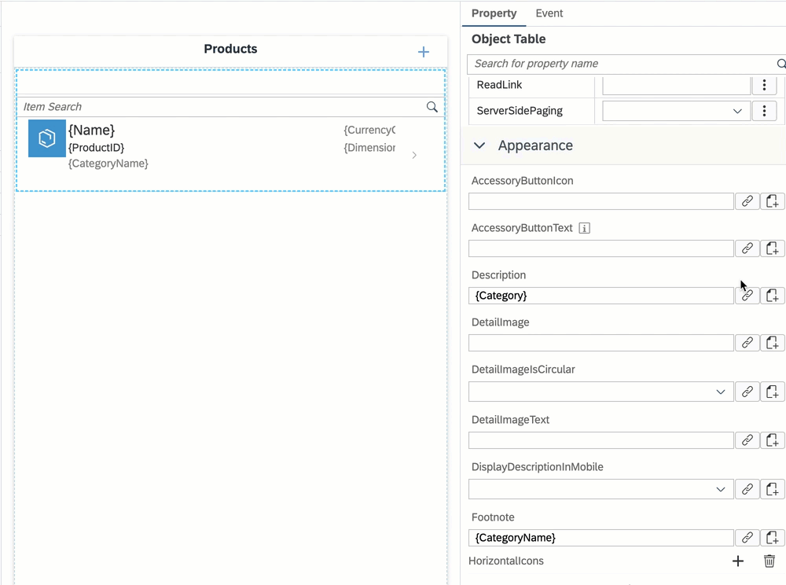

3. Em seguida, você atualizará a propriedade Status do controle, que está atualmente vinculada à propriedade OData *{CurrencyCode}*. Você também adicionará o preço do produto e formatará seu valor usando o formatador de moeda.
   * No painel de propriedades, clique no ícone **link** para a propriedade *Status*.
   * Corte ou remova a expressão padrão no navegador de objetos.
   * Selecione **Objetos i18n** na lista suspensa e selecione **Moeda** na lista suspensa de formatadores.
   * Clique em **Inserir** para gerar a expressão, **não feche a janela do Navegador de objetos**.
        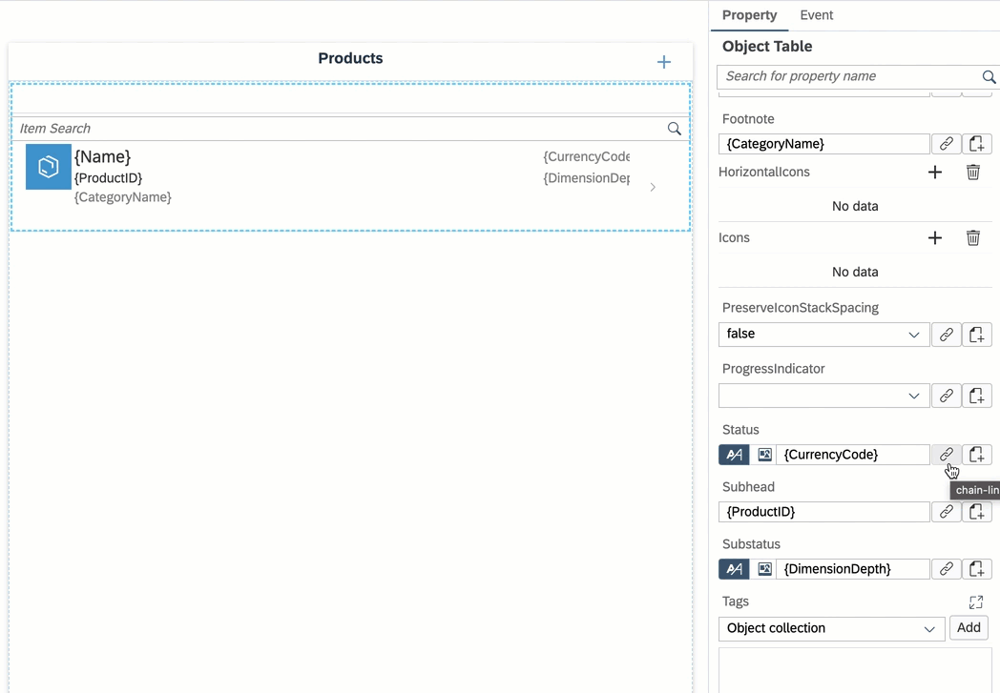
        
        A expressão gerada fica assim:

        ```
        $(C,,,'',{minimumIntegerDigits:1,minimumFractionDigits:0,maximumFractionDigits:2,useGrouping:true})
        ```

    * Agora você vinculará o marcador de posição do valor da moeda com a propriedade *Preço* da entidade *Produtos*. Coloque o cursor antes da segunda vírgula (do lado esquerdo). Escolha a opção **Objetos OData** na lista suspensa, selecione a propriedade **Preço** sob *Produtos* e clique em **Inserir** para gerar a expressão, **não feche a janela do Navegador de objetos**.
        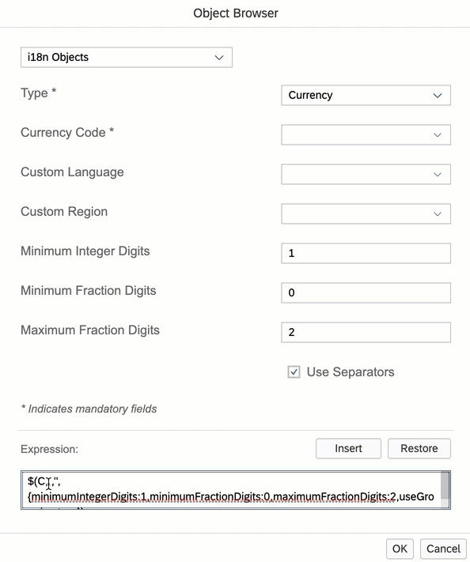
    
        A expressão gerada fica assim:

        ```
        $(C,{Price},,'',{minimumIntegerDigits:1,minimumFractionDigits:0,maximumFractionDigits:2,useGrouping:true})
        ```    

    * Agora você vinculará o marcador de posição do código de moeda com a propriedade *Código de moeda* da entidade *Produtos*. Coloque o cursor antes da terceira vírgula (do lado esquerdo). Selecione a propriedade **CurrencyCode** sob *Produtos* e clique em **Inserir** para gerar a expressão.
        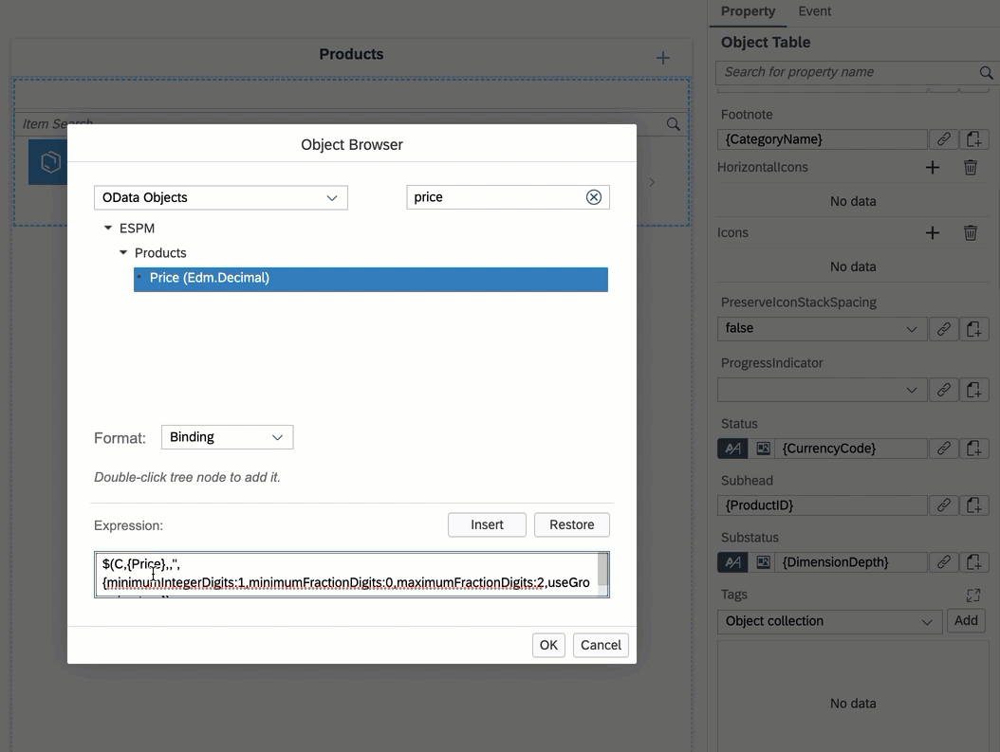
        A expressão gerada fica assim:

        ```
        $(C,{Price},{CurrencyCode},'',{minimumIntegerDigits:1,minimumFractionDigits:0,maximumFractionDigits:2,useGrouping:true})
        ```    

    * Clique em **OK** para definir o valor do campo de controle.
  
        > Você pode encontrar mais detalhes sobre o formatador de moeda na [documentação](https://help.sap.com/doc/f53c64b93e5140918d676b927a3cd65b/Cloud/en-US/docs-en/guides/getting-started/mdk/development/property-binding/i18n-formatter.html#currency-formatter). 
    
4. Em seguida, remova o vínculo padrão para a propriedade **Substatus** e deixe-a em branco.

    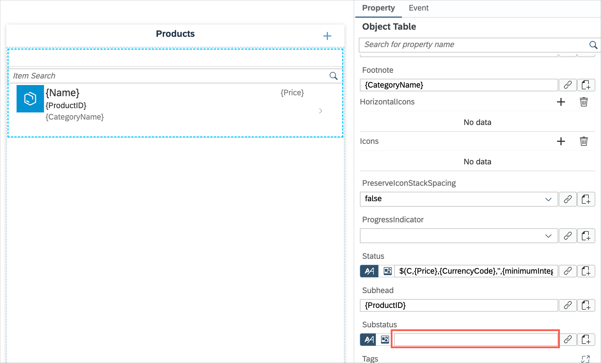


### Exercício 3.2 - Adicione uma barra de feedback de filtro na página

A barra de feedback de filtro é uma barra horizontal que aparece (na Tabela Setorizada) acima de uma lista de conteúdo. Ela usa chips interativos para comunicar quais filtros foram aplicados à lista e permite aos usuários aplicar rapidamente filtros frequentemente usados.

1. Na página `Products_List`, navegue até a `Tabela Setorizada`, conforme destacado abaixo.

    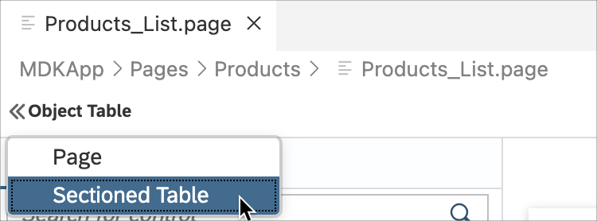

2. No painel Propriedades, selecione **Coleção de Objetos** para a propriedade *FastFilters* sob a seção *FilterFeebackBar*.

    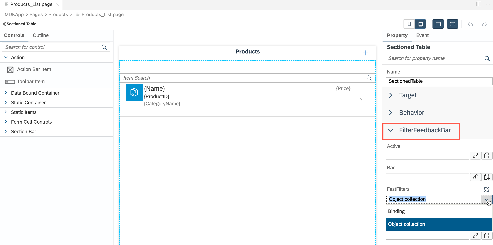

3. Clique em **Adicionar**. Você verá que o objeto *item0* é gerado.

    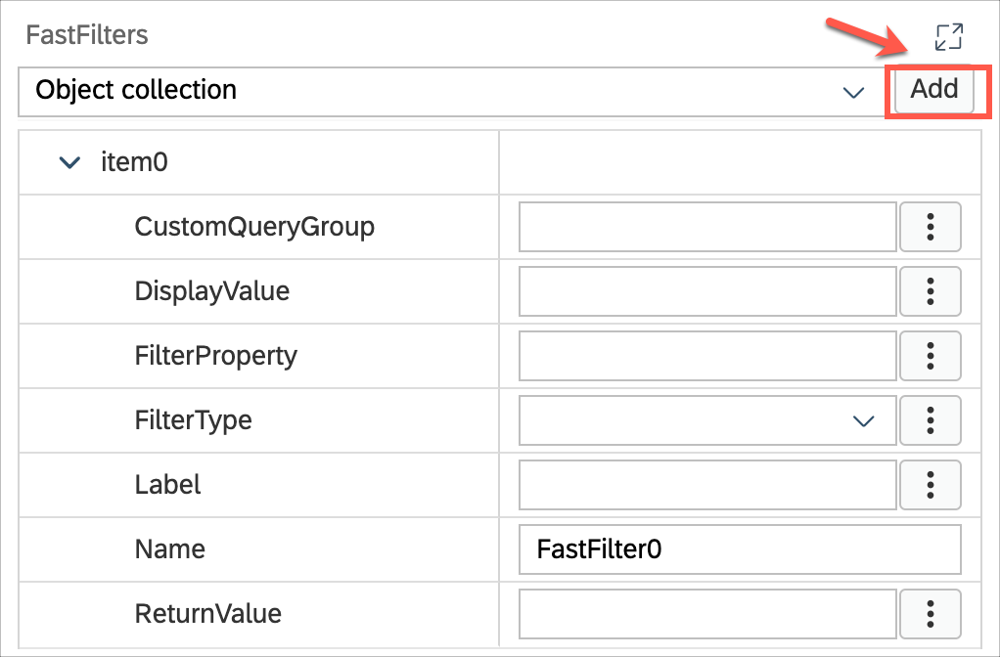

4. Forneça as seguintes informações:

    | Propriedade    | Valor                                |
    | -------------- | ------------------------------------ |
    | `DisplayValue` | Nome                                 |
    | `FilterType`   | Escolha *Ordenador* no menu suspenso |
    | `Label`        | Ordenar por                          |
    | `Name`         | OrderByName                          |
    | `ReturnValue`  | Nome                                 |

    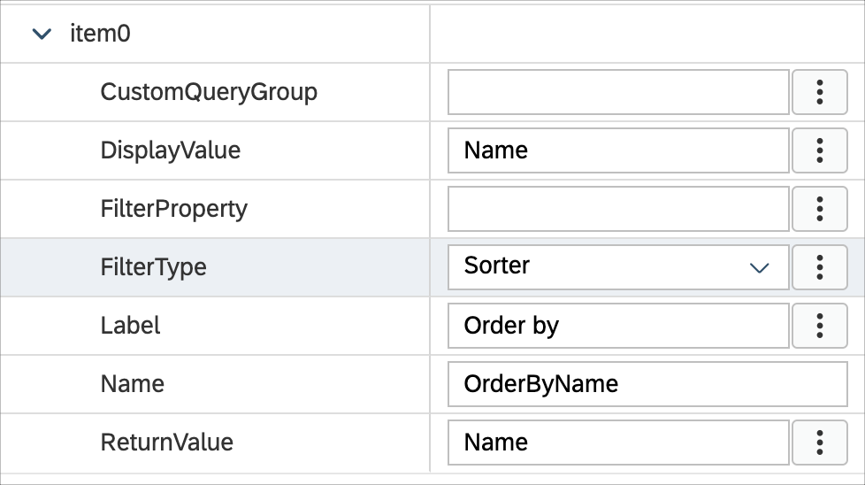

5. Adicione mais 3 itens ao *FastFilters*.

    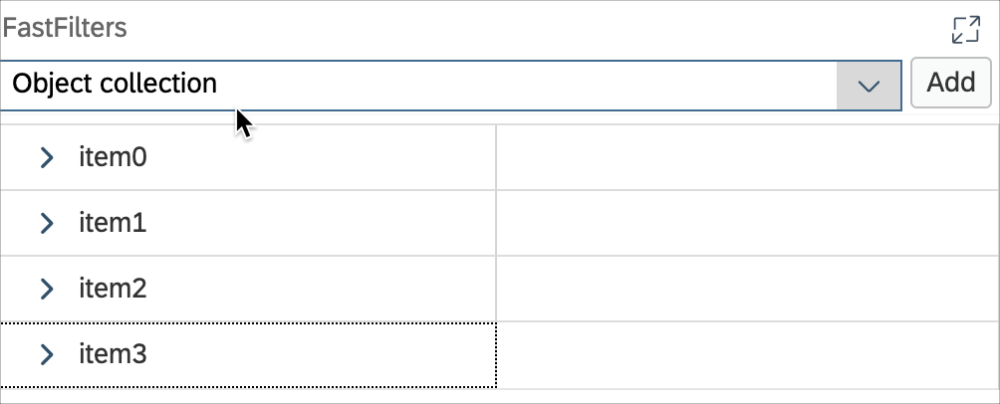

6. Forneça as seguintes informações para o segundo item:

    | Propriedade    | Valor                                |
    | -------------- | ------------------------------------ |
    | `DisplayValue` | Preço                                |
    | `FilterType`   | Escolha *Ordenador* no menu suspenso |
    | `Label`        | Ordenar por                          |
    | `Name`         | OrderByPrice                         |
    | `ReturnValue`  | Preço                                |

    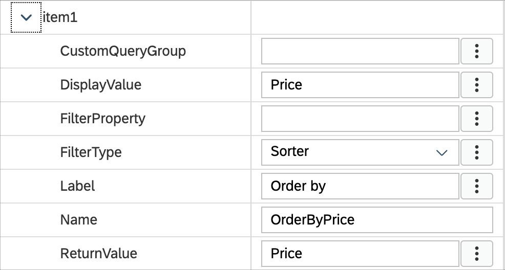

7. Forneça as seguintes informações para o terceiro item:

    | Propriedade        | Valor                             |
    | ------------------ | --------------------------------- |
    | `CustomQueryGroup` | Altura                            |
    | `DisplayValue`     | > 30                              |
    | `FilterType`       | Escolha *Filtro* no menu suspenso |
    | `Label`            | Altura                            |
    | `Name`             | FilterByHeight                    |
    | `ReturnValue`      | DimensionHeight gt 30             |

    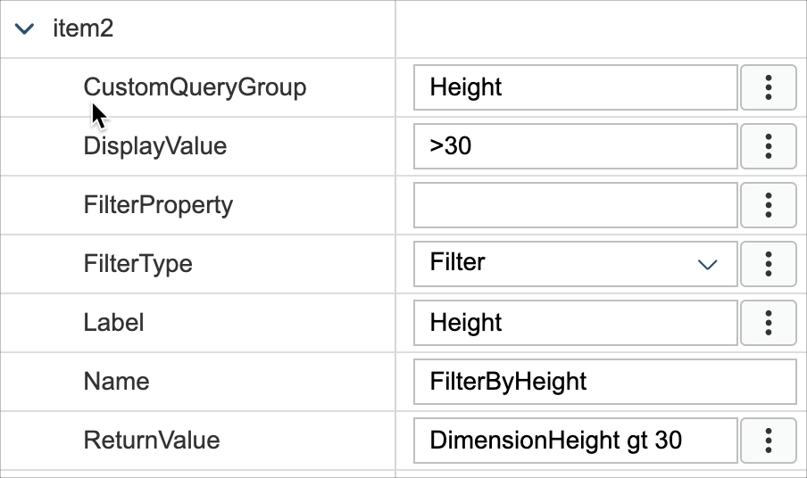

8. Forneça as seguintes informações para o último item:

    | Propriedade        | Valor                             |
    | ------------------ | --------------------------------- |
    | `CustomQueryGroup` | Categoria                         |
    | `DisplayValue`     | Notebooks                         |
    | `FilterProperty`   | CategoryName                      |
    | `FilterType`       | Escolha *Filtro* no menu suspenso |
    | `Name`             | FilterByCategoryName              |
    | `ReturnValue`      | Notebooks                         |

    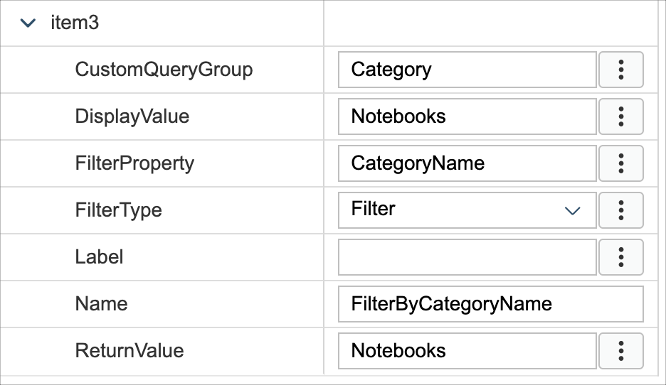

9. Defina como verdadeiro para a propriedade *ShowAllFilters*.

    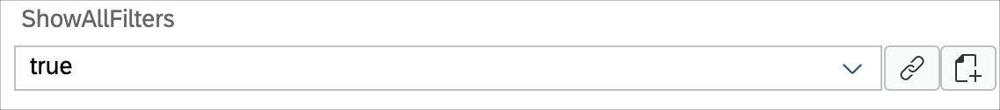

### Exercício 3.3 - Redeploy da aplicação

1. Clique com o botão direito no arquivo `Application.app` no painel do explorador de projetos, selecione `MDK:Deploy` e depois selecione o alvo de implantação como **Serviços Móveis**.

    
    

    >Alternativamente, você pode selecionar *MDK: Redeploy* na paleta de comandos (menu Visualizar>Paleta de Comandos OU pressionar Command+Shift+p no Mac OU pressionar Ctrl+Shift+P no Windows), ele realizará a última implantação.
    >

### Exercício 3.4 - Atualize o aplicativo MDK com novos metadados

Toque em **Atualizar** na página principal, você verá um pop-up _Nova versão disponível_, toque em **Agora**. Toque em **Produtos**, agora você verá uma Barra de Filtro acima da lista de Produtos e há algumas informações adicionais mostradas na lista. 

  |         Android          |           iOS            |
  | :----------------------: | :----------------------: |
  | 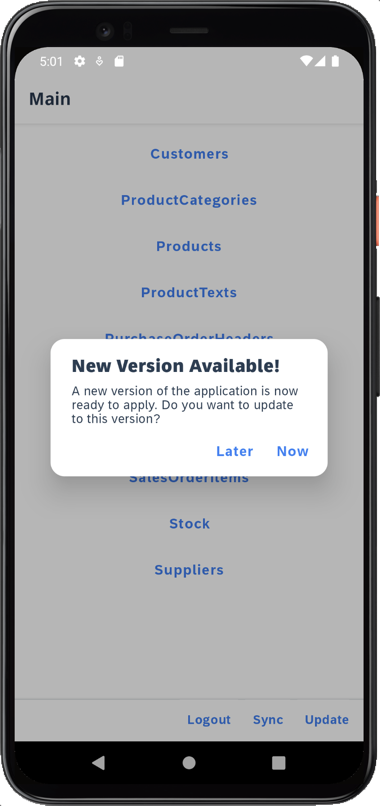 | 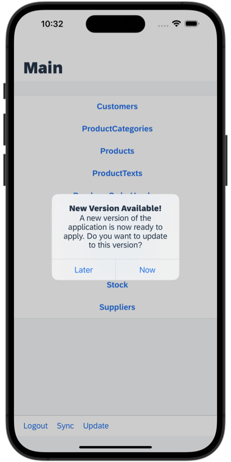 |
  | 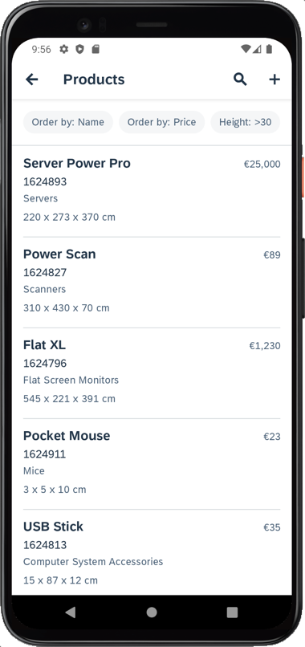 | 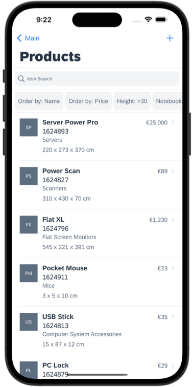 |

## Resumo

Agora você aprimorou a página de lista exibindo algumas informações significativas e também adicionou uma barra de filtro para aplicar rapidamente filtros na lista de produtos. 

Continue em - [Exercício 4 - Carregue um mídia para a entidade Produto](../ex4/README.md)

