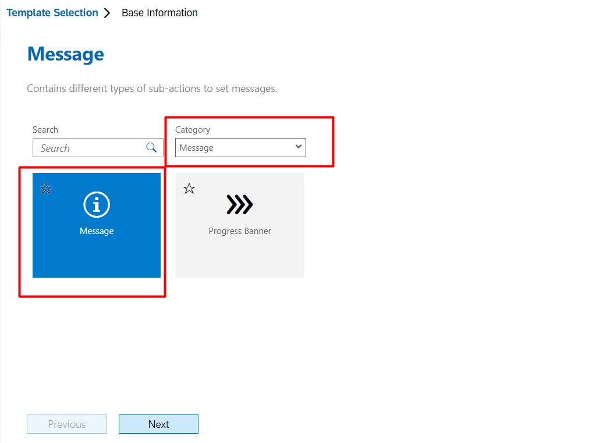
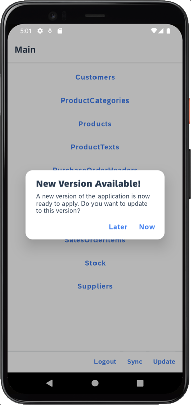

# Exercício 4 - Fazer Upload de uma Mídia para a Entidade Produto

A entidade Produto é uma entidade de mídia OData com a propriedade OData `Picture` com tipo `Edm.Stream`. O estado inicial do serviço OData CAP gerado não tem mídia para nenhum produto. Você irá atualizar a entidade Produto fazendo upload de mídia para ela.

- [Exercício 4 - Fazer Upload de uma Mídia para a Entidade Produto](#exercício-4---fazer-upload-de-uma-mídia-para-a-entidade-produto)
    - [Exercício 4.1 - Adicionar uma caixa de mensagem genérica](#exercício-41---adicionar-uma-caixa-de-mensagem-genérica)
  - [Exercise 4.2 - Adicionar Controle de Anexo na Página de Edição de Produto](#exercise-42---adicionar-controle-de-anexo-na-página-de-edição-de-produto)
    - [Exercício 4.3 - Validar Anexo antes de salvar a Entidade Produto](#exercício-43---validar-anexo-antes-de-salvar-a-entidade-produto)
  - [Exercício 4.4 - Vinculando a Ação de Upload de Fluxo à Ação de Atualização de Produto](#exercício-44---vinculando-a-ação-de-upload-de-fluxo-à-ação-de-atualização-de-produto)
  - [Exercício 4.5 - Redeploy da aplicação](#exercício-45---redeploy-da-aplicação)
    - [Exercício 4.5 - Atualize o aplicativo MDK com novos metadados](#exercício-45---atualize-o-aplicativo-mdk-com-novos-metadados)
  - [Resumo](#resumo)

### Exercício 4.1 - Adicionar uma caixa de mensagem genérica

1. Clique com o botão direito em `Actions`, clique em `MDK: Nova Ação` para criar uma nova ação.

    

2. Escolha **MDK Message Actions** em **Categoria** | clique em **Message Action** | **Próximo**.

    

3. Forneça as seguintes informações:

    | Propriedade     | Valor                              |
    | --------------- | ---------------------------------- |
    | `Action Name`   | GenericMessageBox                  |
    | `Type`          | Select `Message` from the dropdown |
    | `Message`       | Message                            |
    | `OKCaption`     | OK                                 |
    | `OnOK`          | `--None--`                         |
    | `CancelCaption` | leave it blank                     |
    | `OnCancel`      | `--None--`                         |

    

4. Clique em **Próximo** e depois em **Concluir** na etapa de confirmação.

## Exercise 4.2 - Adicionar Controle de Anexo na Página de Edição de Produto

1. Acesse `Páginas` | `Produtos` | `Products_Edit.page`. O modelo CRUD gera automaticamente essa página com todos os campos do conjunto de entidades.

2. Arraste e solte um controle de **Anexo** na área da página (por exemplo, logo antes do controle *ListPicker* do fornecedor).

    

3. Forneça as informações abaixo:

    | Campo                  | Valor                          |
    | ---------------------- | ------------------------------ |
    | `Name`                 | Picture                        |
    | `AttachmentActionType` | Desmarque a opção *SelectFile* |
    | `AttachmentAddTitle`   | Browse                         |
    | `AttachmentTitle`      | Picture                        |

    

4. Se um Produto já possui uma mídia, você pode querer exibi-la enquanto atualiza o registro. Você pode escrever uma lógica para obter o anexo atual. Para a propriedade de Valor do controle, clique no ícone **Criar uma regra**.

    

5. Selecione *Tipo de objeto* como **Regra** e *Pastas* como **/MDKApp/Rules/Products**. Clique em **OK**.

    

    > É bom manter todos os arquivos relacionados na mesma pasta.

6. Forneça um Nome **Products_GetCurrentAttachment** para a sua regra, clique em **Próximo** e **Concluir** a etapa de confirmação.

    

7. O arquivo `Products_GetCurrentAttachment.js` será aberto no editor de código. Substitua seu conteúdo com o trecho abaixo:

    ```javascript
    export default function Products_GetCurrentAttachment(context) {
        let pageProxy = context.getPageProxy();
        let readLink = context.binding['@odata.readLink'];
        //get OData cache image path
        return pageProxy.getODataCacheImagePath(`/MDKApp/Services/ESPM.service/${readLink}/Picture`).then((imagePath) => {
            if (imagePath) {
            const entitySet = 'Products';
            const property = 'Picture';
            const service = '/MDKApp/Services/ESPM.service';
            //createAttachmentEntry ClientAPI will create an object for attachment entry
            return [context.createAttachmentEntry(imagePath, entitySet, property, readLink, service)];
        } else {
            return [];
        }
        });
    }
    ```

8. Como há apenas uma propriedade de Stream disponível para a entidade de Produto, é importante informar o usuário caso ele tente anexar mais de uma mídia. Acesse a aba **Evento**, clique em **Criar uma regra/ação** para o evento `OnValueChange`.

    

9. Selecione *Tipo de objeto* como **Regra** e *Pastas* como **/MDKApp/Rules/Products**. Clique em **OK**.

    

10. Forneça um nome **Products_AttachmentOnValueChange** para sua regra, clique em **Próximo** e **Concluir** na etapa de confirmação.

    

11. O arquivo `Products_AttachmentOnValueChange.js` será aberto no editor de código. Substitua seu conteúdo pelo trecho abaixo:

    ```javascript
    export default function Products_AttachmentOnValueChange(context) {
        var attachments = context.getValue();
        if (attachments.length !== 1) {
            return context.executeAction({
                "Name": '/MDKApp/Actions/GenericMessageBox.action',
                "Properties": {
                    "Message": attachments.length < 1 ? "Please add 1 product image" : "Max. 1 image allowed for the product",
                    "Title": "Alert",
                    "OKCaption": "OK"
                
                }
            })
        };
    }
    ```
### Exercício 4.3 - Validar Anexo antes de salvar a Entidade Produto

1. A regra `Products_AttachmentOnValueChange.js` alerta o usuário sobre o número máximo permitido de imagens para o Produto. No entanto, mais de uma imagem pode ser adicionada. No caso de haver mais de uma imagem anexada, o usuário não deve ser capaz de salvar o registro. Eles só deveriam ser capazes de salvar o registro quando houver apenas uma imagem anexada a uma entidade de produto. Você escreverá uma lógica de validação de anexo e a vinculará ao item `Salvar` da barra de ações. Selecione o item de barra de ações **Salvar** e navegue até sua guia de **Evento**. Remova o vínculo existente.

    

2. Quando removido, clique em **Criar uma regra/ação** para o evento `OnPress` para o item `Salvar` da barra de ações.

    

3. Selecione *Tipo de objeto* como **Regra** e *Pastas* como **/MDKApp/Rules/Products**. Clique em **OK**.

    

4. Forneça um Nome **Products_ValidateAttachment** para sua regra, clique em **Próximo** e conclua a etapa de confirmação em **Concluir**.

    

5. O arquivo `Products_ValidateAttachment.js` será aberto no editor de código. Substitua seu conteúdo com o snippet abaixo:

    ```javascript
    export default function Products_ValidateAttachment(context) {
        var attachments = context.evaluateTargetPath('#Control:Picture/#Value');
        if (attachments.length !== 1) {
            return context.executeAction({
                "Name": '/MDKApp/Actions/GenericMessageBox.action',
                "Properties": {
                    "Message": attachments.length < 1 ? "Please add 1 product image" : "Max. 1 image allowed for the product",
                    "Title": "Alert",
                    "OKCaption": "OK"
                }
            })
        } else {
            return context.executeAction('/MDKApp/Actions/Products/Products_UpdateEntity.action');
        }
    }
    ```

## Exercício 4.4 - Vinculando a Ação de Upload de Fluxo à Ação de Atualização de Produto

O modelo gera ações relacionadas ao upload de fluxo para o backend, portanto, quando um Produto é atualizado, você pode querer acionar o upload do fluxo em seu sucesso.

Acesse `Actions` | `Products` |  `Products_UpdateEntity.action` e substitua o vínculo existente para a **Ação de Sucesso** para `Products_UploadStream.action`.


    
## Exercício 4.5 - Redeploy da aplicação

1. Clique com o botão direito do mouse no arquivo `Application.app` no painel do explorador de projetos, selecione `MDK: Deploy` e, em seguida, selecione o destino de implantação como **Mobile Services**.

    
    

    >Alternativamente, você pode selecionar *MDK: Redeploy* na paleta de comandos (menu Exibir> Paleta de Comandos OU pressione Command+Shift+p no Mac OU pressione Ctrl+Shift+P em máquina Windows), ela executará a última implantação.
    >

### Exercício 4.5 - Atualize o aplicativo MDK com novos metadados

| Etapas                                                                                                                                                                           |                                  Android                                  |                                                                iOS |
| :------------------------------------------------------------------------------------------------------------------------------------------------------------------------------- | :-----------------------------------------------------------------------: | -----------------------------------------------------------------: |
| 1. Toque em **Atualizar** na página principal, você verá uma janela pop-up _Nova versão disponível_, toque em **Agora**.                                                         |                                                   |                                            |
| 2. Toque em **Produtos** > Toque em qualquer registro para navegar até a página de Detalhes.                                                                                     |              Toque no ícone Editar                |        Toque no item Editar da ActionBar.  |
| 3. Role a página. Observação: certifique-se de conceder ao aplicativo `Mobile Svcs` as permissões necessárias para acessar a câmera/fotos/mídia, caso tire ou adicione uma foto. | Toque na opção `Procurar` para anexar uma imagem  | Toque no ícone `+` para anexar uma imagem  |
| 4. Uma vez carregada, salve o registro.                                                                                                                                          |                                                   |                                            |
| 5. Depois de salvar, a página será fechada e você será redirecionado para a página de Detalhes do Produto. Você notará a imagem carregada aparecer no Cabeçalho.                 |                                                   |                                           |
| 6. Navegue de volta para a página de lista de Produtos, você verá a Imagem aparecendo no registro de Produto.                                                                    |                                                  |                                           |

> Se você tentar fazer upload de mais de uma imagem, receberá um aviso sobre o número máximo permitido de imagens e não poderá salvar o registro até remover/excluir os anexos extras.

> Se você editar o registro recentemente atualizado (com imagem), notará que a imagem existente aparece no controle de Anexo.

## Resumo

Você agora fez upload de um anexo para a entidade de Produto.

Continuar para - [Exercício 5 - Usar navegação com gaveta lateral para o seu aplicativo](../ex5/README.md)

