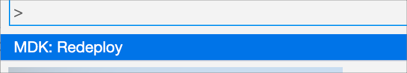

# Exercício 5 - Usar a navegação de gaveta lateral para sua aplicação

Neste exercício, você criará uma nova página usando o tipo de página de navegação de gaveta lateral e adicionará itens de gaveta lateral para exibir informações.

- [Exercício 5 - Usar a navegação de gaveta lateral para sua aplicação](#exercício-5---usar-a-navegação-de-gaveta-lateral-para-sua-aplicação)
    - [Exercício 5.1 - Criar uma página de navegação de gaveta lateral](#exercício-51---criar-uma-página-de-navegação-de-gaveta-lateral)
    - [Exercício 5.2 - Adicionar itens adicionais à seção de gaveta lateral](#exercício-52---adicionar-itens-adicionais-à-seção-de-gaveta-lateral)
    - [Exercício 5.3 - Defina a primeira página como a página de visão geral](#exercício-53---defina-a-primeira-página-como-a-página-de-visão-geral)
    - [Exercício 5.4 - Redistribua o aplicativo](#exercício-54---redistribua-o-aplicativo)
    - [Exercício 5.5 - Atualize o aplicativo MDK com novos metadados](#exercício-55---atualize-o-aplicativo-mdk-com-novos-metadados)
  - [Resumo](#resumo)

### Exercício 5.1 - Criar uma página de navegação de gaveta lateral

A página de navegação de gaveta lateral fornece uma opção de navegação de menu de slide-out e pode ser usada para fornecer funcionalidade semelhante ao tipo de página de navegação inferior, mas suporta mais de 5 áreas dentro de sua aplicação. Este tipo de página só pode ser usado como a `MainPage` no `Application.app`.

1. No projeto SAP Business Application Studio, clique com o botão direito do mouse em `Pages` | `MDK: New Page`.

    
   
2. Selecione `Side Drawer Navigation Page` e clique em `Next`.

    

3. Insira o `Nome da Página` como **Visão geral** e clique em `Next` e `Finish` na etapa de confirmação.

    

   A página gerada tem um cabeçalho e uma seção de gaveta lateral padrão.
   
    

  No próximo passo, você atualizará o esquema padrão da página e adicionará algumas seções adicionais da gaveta lateral.

4. Selecione a área do cabeçalho e clique no ícone `link` para a propriedade **Headline** para abrir o Object Browser. Escolha **Control & Client Data** no menu suspenso e clique duas vezes em `UserId(Value)`. Clique em **OK** para definir o valor no campo de controle.

    

    > `#Application / #AppData / UserId` retornará o `UserId` do usuário atual. Você pode encontrar mais informações sobre esse caminho de destino nesta [documentação] (https://help.sap.com/doc/f53c64b93e5140918d676b927a3cd65b/Cloud/en-US/docs-en/guides/getting-started/mdk/development/property-binding/target-path.html#targeting-properties-on-applications-appdata-and-clientdata-object).

5. Para outras propriedades, forneça as informações abaixo: 

    | Propriedade      | Valor                                   |
    | ---------------- | --------------------------------------- |
    | `IconIsCircular` | true                                    |
    | `SubHeadline`    | Remova o valor padrão e deixe em branco |

    

6. Selecione `Item0` na visualização da página. No painel `Propriedades`, na seção `Dados`, clique no nó de expansão para `Item0` e forneça as informações abaixo no painel Propriedades para exibir a lista de clientes.

    | Propriedade  | Valor                                                                                                |
    | ------------ | ---------------------------------------------------------------------------------------------------- |
    | `Image`      | sap-icon://customer                                                                                  |
    | `Name`       | Clientes                                                                                             |
    | `PageToOpen` | clique no ícone de 3 pontos, selecione o `Object Browser` e vincule-o à página *Customers_List.page* |
    | `Title`      | Clientes                                                                                             |

      

    Agora você verá que o item da seção do Drawer lateral está vinculado a Clientes.

    

### Exercício 5.2 - Adicionar itens adicionais à seção de gaveta lateral

Agora você adicionará itens adicionais para exibir outras informações.

1. Clique no botão **Adicionar** e adicione mais 3 itens.

    Agora você terá um total de 4 itens.

    

2. Forneça as informações abaixo para o segundo item no painel Propriedades para exibir a lista de produtos:

    | Propriedade  | Valor                                                                                                     |
    | ------------ | --------------------------------------------------------------------------------------------------------- |
    | `Imagem`     | sap-icon://product                                                                                        |
    | `Nome`       | Produtos                                                                                                  |
    | `PageToOpen` | clique no ícone de 3 pontos, selecione o `Navegador de objetos` e vincule-o à página *Products_List.page* |
    | `Título`     | Produtos                                                                                                  |

    

3. Forneça as informações abaixo para o terceiro item no painel Propriedades para exibir a lista de fornecedores:

    | Propriedade  | Valor                                                                                                      |
    | ------------ | ---------------------------------------------------------------------------------------------------------- |
    | `Imagem`     | sap-icon://supplier                                                                                        |
    | `Nome`       | Fornecedores                                                                                               |
    | `PageToOpen` | clique no ícone de 3 pontos, selecione o `Navegador de objetos` e vincule-o à página *Suppliers_List.page* |
    | `Título`     | Fornecedores                                                                                               |

    

4. Forneça as informações abaixo para o quarto item no painel Propriedades para exibir a lista de pedidos de venda:

    | Propriedade  | Valor                                                                                                              |
    | ------------ | ------------------------------------------------------------------------------------------------------------------ |
    | `Imagem`     | sap-icon://sales-order                                                                                             |
    | `Nome`       | Pedidos de venda                                                                                                   |
    | `PageToOpen` | clique no ícone de 3 pontos, selecione o `Navegador de objetos` e vincule-o à página *SalesOrderHeaders_List.page* |
    | `Título`     | Pedidos de venda                                                                                                   |

    

    O layout da página de visão geral deve ficar assim:

    

### Exercício 5.3 - Defina a primeira página como a página de visão geral

No projeto gerado pelo modelo, já há uma página chamada *Main.page*, que também é a página que abre após o sucesso do registro. Para este exercício, você irá alterar o comportamento padrão do lançamento do aplicativo, vinculando-o à *página Visão geral*. Por favor, note que o tipo de página de navegação Side Drawer só pode ser usado como MainPage em Application.app, você não pode abri-lo estando em qualquer outra página.

1. Clique no arquivo `Application.app`, selecione a **página Visão geral** para a propriedade `Página principal`.

    

### Exercício 5.4 - Redistribua o aplicativo

1. Clique com o botão direito do mouse no arquivo `Application.app` no painel do explorador de projetos, selecione `MDK: Distribuir` e, em seguida, selecione o destino de distribuição como **Serviços Móveis**.

    
    

    >Alternativamente, você pode selecionar *MDK: Redistribuir* no painel de comando (menu Visualizar> Painel de comando OU pressione Command+Shift+p no Mac OU pressione Ctrl+Shift+P no Windows), ele irá executar a última distribuição.
    >

### Exercício 5.5 - Atualize o aplicativo MDK com novos metadados

Toque em **Atualizar** na página principal, você verá um pop-up _Nova versão disponível_, toque em **Agora**.
Agora, você verá a página principal como a página Visão geral, onde seu nome, sobrenome e ID do usuário são exibidos na seção do cabeçalho e uma seção com vários itens para navegar em diferentes áreas para ver o conteúdo da página.

  |         Android          |           iOS            |
  | :----------------------: | :----------------------: |
  |  |  |
  |  |  |

## Resumo

Agora você tem a página de navegação Side Drawer como a página principal para navegar dentro do aplicativo.

Continuar em - [Exercício 6 - Adicionar uma seção de menu do usuário ao aplicativo](../ex6/README.md)
