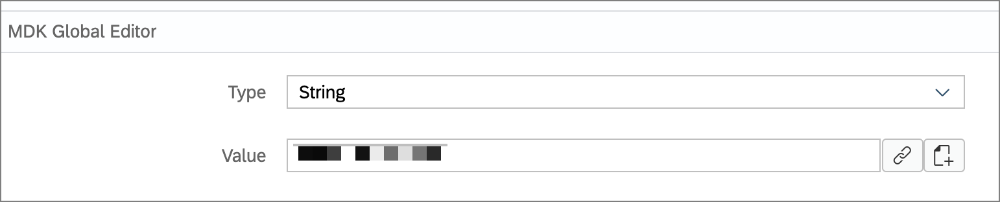
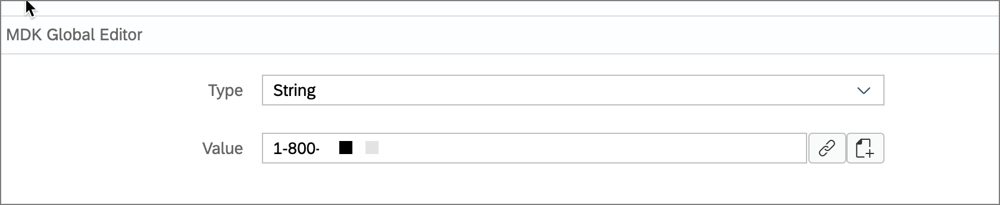
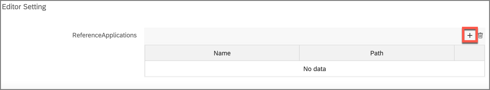
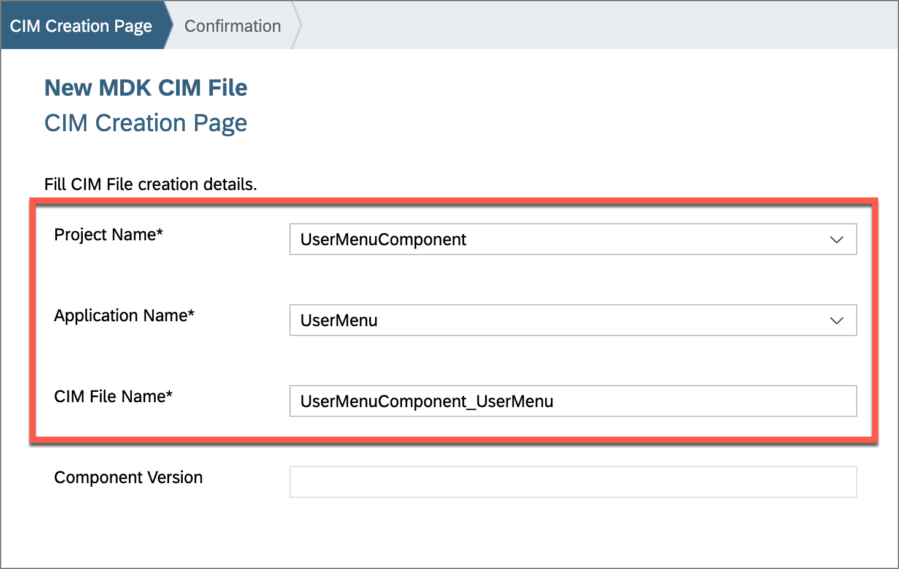

# Exercício 6 - Adicionar uma seção de Menu de Usuário à aplicação

Neste exercício, adicionaremos uma seção de Menu de Usuário à página Visão geral da aplicação. Como as funções no Menu de Usuário são genéricas e podem ser aplicadas a quase qualquer aplicação MDK, o Menu de Usuário foi pré-criado e será adicionado à aplicação como um Componente MDK.

- [Exercício 6 - Adicionar uma seção de Menu de Usuário à aplicação](#Exercício-6---adicionar-uma-seção-de-menu-de-usuário-à-aplicação)
- [Exercício 6.1 - Copie a aplicação UserMenuComponent para o seu espaço de trabalho](#Exercício-61---copie-a-aplicação-usermenucomponent-para-o-seu-espaço-de-trabalho)
- [Exercício 6.2 - Copie as configurações da aplicação Component para a aplicação Base e modifique-as](#Exercício-62---copie-as-configurações-da-aplicação-component-para-a-aplicação-base-e-modifique-as)
- [Exercício 6.3 - Atualizar as Aplicações de Referência](#Exercício-63---atualizar-as-aplicações-de-referência)
- [Exercício 6.4 - Criar um arquivo CIM para o Componente de Menu do Usuário](#exercício-64---criar-um-arquivo-cim-para-o-componente-de-menu-do-usuário)
- [Exercício 6.5 - Adicione a seção do menu lateral do usuário](#exercício-65---adicione-a-seção-do-menu-lateral-do-usuário)
- [Exercício 6.6 - Redeploy da aplicação](#exercício-66---redeploy-da-aplicação)
- [Exercício 6.7 - Atualize o aplicativo MDK com novos metadados](#exercício-67---atualize-o-aplicativo-mdk-com-novos-metadados)
- [Resumo](#resumo)

O Menu de Usuário contém os seguintes itens.
| Opção de Menu          | Descrição                                                                                                                                                                                            |
| ---------------------- | ---------------------------------------------------------------------------------------------------------------------------------------------------------------------------------------------------- |
| `Sincronizar Mudanças` | Esta opção é aplicável apenas a aplicativos off-line. Ele permite enviar quaisquer alterações locais do cliente móvel para o backend e também baixar qualquer dado do backend para o cliente móvel. |
| `Suporte`              | A opção de Suporte fornece uma maneira fácil para os usuários entrarem em contato com o suporte por meio de campos de contato. As informações de contato são definidas em globals. A opção Log de Atividade na página de Suporte permite que o usuário ligue / desligue o registro do cliente, defina o nível de registro e, se ativado no aplicativo de Serviços Móveis, também faça upload dos logs atuais do cliente. |
| `Verificar Atualizações` | Esta opção verificará se novos Metadados foram implantados na Atualização do Aplicativo de Serviços Móveis. Se novos Metadados forem encontrados, eles serão baixados e solicitarão ao usuário que aplique as alterações. |
| `Sobre` | A página Sobre exibe o ID do usuário / dispositivo atual juntamente com o nome do aplicativo, versão do Metadados e informações da versão do cliente. |
| `Redefinir` | Esta opção redefinirá completamente o cliente. Isso apagará quaisquer dados e metadados do aplicativo baixados e retornará o usuário à tela de boas-vindas. |

## Exercício 6.1 - Copie a aplicação UserMenuComponent para o seu espaço de trabalho

Como o User Menu requer a configuração de algumas opções, copiaremos o componente para o nosso espaço de trabalho.

1. Expanda o repositório da sessão `teched2022-AD181` | `Exercícios` | pasta `ex6`
2. Clique com o botão direito na pasta **UserMenuComponent** e selecione `Copiar`.

    

3. Feche as pastas do projeto no painel Explorer. Clique com o botão direito do mouse abaixo de todas as pastas do projeto no espaço vazio do painel Explorer e selecione `Colar` para colar o *UserMenuComponent* no espaço de trabalho como uma nova pasta.

    

    

## Exercício 6.2 - Copie as configurações da aplicação Component para a aplicação Base e modifique-as

O User Menu Component foi projetado para ser usado em diferentes aplicativos. Em sua aplicação Base, você reutilizará as configurações existentes da sua aplicação de componente e as configurará de acordo com seus requisitos.

1. Expanda o projeto `UserMenuComponent` | `Globals`. Clique com o botão direito na pasta `Application`, selecione `Copiar`.

    

2. Em `MDKApp`, clique com o botão direito em `Globals` e cole-a lá.

    

3. Vamos começar a modificar essas configurações. Na pasta `MDKApp` | `Globals` | `Application`, selecione `ApplicationName.global` e edite o valor para ser o nome amigável do seu aplicativo.

    

4. Na página de suporte, o usuário tem opções para entrar em contato com o suporte por telefone, e-mail e FaceTime. Selecione `UserSupportEmail.global` e defina o valor como o endereço de e-mail para consultas de suporte ao usuário.

    

5. Selecione `UserSupportFaceTime.global` e defina o número de telefone para consultas de suporte FaceTime do usuário. Isso só se aplica a dispositivos iOS.

    

6. Selecione `UserSupportPhone.global` e defina o valor como o número de telefone para consultas de suporte do usuário.

    

7. Selecione `AppDefintion_Version.global` e edite o número da versão para os metadados do seu aplicativo (se desejado).

    

### Exercício 6.3 - Atualizar as Aplicações de Referência

Ao trabalhar com aplicações de componentes MDK, a fim de validar entradas e permitir a seleção de objetos do componente, as aplicações precisam de uma referência para a outra aplicação.

Iremos definir a entrada de aplicações de referência tanto na aplicação `MDKApp` quanto na aplicação `UserMenuComponent`. A configuração não tem efeito em tempo de execução no cliente.

1. Expanda a pasta da aplicação `MDKApp` e selecione `Application.app` para abrir o MDK Application Editor.

    

2. Role até a seção Reference Applications e clique no botão Adicionar no cabeçalho da tabela.

    

3. No Object Browser, clique duas vezes no projeto da sua aplicação de componente para defini-la na área de Expressão e clique em `OK` para salvar a alteração.

    

4. Feche a janela do editor de Application.app.

    

    Você repetirá esse processo na aplicação MDKApp também.

5. Expanda a pasta `UserMenuComponent` e selecione `Application.app` para abrir o MDK Application Editor.

    

6. Role até a seção Reference Applications e clique no botão Adicionar no cabeçalho da tabela.

    

7. No Object Browser, clique duas vezes no projeto da sua aplicação MDK para defini-la na área de Expressão e clique em `OK` para salvar a alteração.

    

8. Feche a janela do editor de Application.app.

    

### Exercício 6.4 - Criar um arquivo CIM para o Componente de Menu do Usuário

Para que o aplicativo Componente de Menu do Usuário seja incluído durante a implantação do aplicativo `MDKApp` e para especificar as substituições do aplicativo `MDKApp` no aplicativo `UserMenuComponent`, é necessário um arquivo CIM no aplicativo `MDKApp`.

1. Clique com o botão direito no arquivo `Application.app` no projeto `MDKApp` no painel do explorador e selecione `MDK: New CIM`

    

2. Forneça as informações necessárias e clique em **Finish** para concluir.

    | Campo                 | Valor                                             |
    | --------------------- | ------------------------------------------------- |
    | `Project Name`     | Selecione o primeiro **UserMenuComponent** na lista suspensa |
    | `Application Name`  | Selecione o primeiro **UserMenu** na lista suspensa          |
    | `CIM File Name` | Deixe como valor padrão                           |

    

3. Na tabela de Integration Points, clique no botão `Add` e selecione `Action` no menu.

    

4. Para o arquivo `Origem`, clique no ícone de `link` para abrir o navegador de objetos.

    

5. Digite `sync` no campo de pesquisa e dê um duplo clique no `SyncStartedMessage.action` do `MDKApp` para defini-lo na Expressão e clique em `OK`.

    

6. Para o arquivo de `Destino`, abra o navegador de objetos, digite `sync` no campo de pesquisa e dê um duplo clique no `SyncStartedMessage.action` do seu aplicativo `UserMenu` para defini-lo na Expressão e clique em `OK`.

    

7. Clique no botão `check` para criar o ponto de integração.

    
    

8. Da mesma forma, substitua as variáveis globais.
Na tabela de Pontos de Integração, clique no botão `Add` e selecione `Global` no menu.  

    

9. Para o arquivo `Origem`, clique no ícone de `link` para abrir o navegador de objetos.

    

10. Dê um duplo clique no `AppDefintion_Version.global` do `MDKApp` para defini-lo na Expressão e clique em `OK`.

    

11. Para o arquivo de `Destino`, abra o navegador de objetos e dê um duplo clique no `AppDefintion_Version.global` do seu aplicativo `UserMenu` para defini-lo na Expressão e clique em `OK`.

    

12. Clique no botão `check` para criar o ponto de integração.

    
      

13. Da mesma forma, adicione pontos de integração substituindo as outras variáveis globais `ApplicationName.global`, `UserSupportEmail.global`, `UserSupportFaceTime.global` e `UserSupportPhone.global`.

    

### Exercício 6.5 - Adicione a seção do menu lateral do usuário

A seção do menu lateral do usuário precisa ser adicionada ao `MDKApp`.

Abra a página `Overview.page` e arraste e solte um Fragmento `SideDrawerUserMenuSection` da paleta de controles para o lado esquerdo da barra de ações da página Customers.

### Exercício 6.6 - Redeploy da aplicação

1. Clique com o botão direito no arquivo `Application.app` no painel de navegação do projeto, selecione `MDK:Deploy` e, em seguida, selecione o alvo de implantação como **Mobile Services**.

    
    

    > Alternativamente, você pode selecionar *MDK: Redeploy* no painel de comando (Menu Exibir>Painel de Comando OU pressione Command+Shift+p no Mac OU pressione Ctrl+Shift+P em um computador com Windows), ele irá executar a última implantação.
    >

### Exercício 6.7 - Atualize o aplicativo MDK com novos metadados

| Passos                                                                                                                                                                                               |         Android          |                      iOS |
| :--------------------------------------------------------------------------------------------------------------------------------------------------------------------------------------------------- | :----------------------: | -----------------------: |
| 1. Inicie o aplicativo no seu dispositivo, autentique-se com o código de acesso ou autenticação biométrica, se solicitado. Você verá uma janela pop-up *Nova Versão Disponível*, toque em **Agora**. |  |  |
| 2. Agora você verá que a página Overview possui uma seção de menu do usuário.                                                                                                                        |  |  |

## Resumo

Agora você adicionou o Componente MDK de Menu do Usuário à sua aplicação.

Parabéns, você concluiu a sessão SAP TechEd 2022 *DEV181 - Compondo aplicativos móveis de qualidade empresarial no SAP BTP.*

Para continuar aprendendo sobre o Mobile Development Kit, visite os recursos na seção [Recursos Adicionais de Suporte e Aprendizado](../../README.md#additional-support-and-learning-resources).
